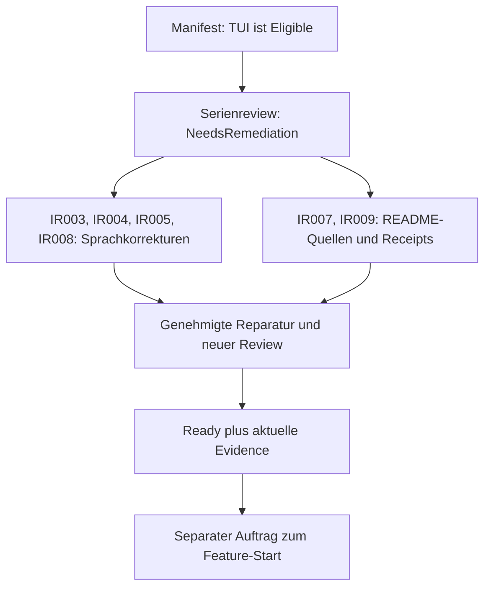

# Serien-Intake-Review: tinycalc-delivery

## Ergebnis

Stand: 2026-10-04. Ergebnis: **NeedsRemediation**. Alle 13 Lastenhefte wurden
inhaltlich geprüft: vier abgeschlossene Archivmitglieder und neun aktive
Mitglieder. Es gibt sechs mittlere Befunde, keine hohen oder kritischen Befunde,
keine offenen Fragen und keine menschlich akzeptierten Restrisiken. Dies ist
ein Serienreview, keine Kampagne: null Worker.

Die maschinenlesbare Identität, UTC-Zeit, vollständigen Ziel-Hashes und
Git-Blobs stehen in [intake-review-result.json](intake-review-result.json).
Der geprüfte Git-Stand ist `45f8fb00119302d4a4c24eeccfe340a931f64405` auf `main`.
Das Ergebnis gilt für diese lokalen Inhalte, nicht als Live-GitHub-Status.

## Befunde und erforderliche Korrekturen

| ID | Schwere | Ziel | Befund und begrenzte nächste Arbeit |
|---|---|---|---|
| IR003 | Medium | Secure Development | Vorwissen und Erstgebrauchserklärungen ergänzen; den vollständigen normativen deutschen Vertrag auf Englisch bereitstellen. |
| IR004 | Medium | Sandbox-Härtung | Vorwissen und Begriffe wie Mounts, Tokens und Caches erklären; Anforderungen und Abnahme vollständig auf Englisch bereitstellen. |
| IR005 | Medium | Rename | Englische Kurzfassungen ersetzen/ergänzen: Anforderungen `R-RN-TC-01..12`, Abnahme `AK-RN-TC-01..09`, Entscheidungen `IAD001..005` und Workflow-Erklärungen müssen gleichwertig verständlich sein. |
| IR007 | Medium | TUI-Funktionsabnahme | README-Quellbindung im Authoring-Receipt ist veraltet. README-Änderung fachlich abgleichen; Receipt und Lineage erst mit ausdrücklicher Freigabe erneuern. |
| IR008 | Medium | TUI, A11Y, PL/0, Legacy, Tabellenoperationen | Vollständige englische normative Inhalte statt Kurzfassungen; Erstgebrauchserklärungen ergänzen. IDs, Grenzen und Schwellenwerte unverändert lassen. |
| IR009 | Medium | Rename | Auch dieses Authoring-Receipt bindet einen veralteten README-Hash. Eigener Befund, weil beide Receipts unabhängig erneuert und validiert werden müssen. |

Für alle Befunde ist Thorsten Hindermann der Entscheidungsinhaber. Kein Risiko
wurde stellvertretend akzeptiert. Die konkreten Hashes, Belegstellen,
Dispositionen und Wiederprüfungsauslöser stehen im JSON-Ergebnis.

Sprachlücken sind nicht bloß fehlende Überschriften: Bei TUI fehlen in der
Kurzfassung unter anderem die exakten Coverage- und Vertragsfortschreibungsregeln,
bei A11Y die Kontrastschwellen und der Impact-abhängige Nachweis. PL/0 bindet
deutsche Diagnosen mit Zeile/Spalte und einen klassifizierten Dependency-Preflight.
Legacy bindet authentische Fixture-Herkunft, Lizenzgrenzen und die eng begrenzte
BCD-Gegenevidenz. Tabellenoperationen binden unveränderliche Kopier-/Vorschaupläne,
persistenten und abgeleiteten Zellzustand sowie atomare Fehlerpfade. Diese
Details müssen auch für englisch lesende Lernende vollständig vorliegen.

Ein synchronisierter `.EN.md`-Sidecar ist gemäß Repository-Regel möglich.
Er darf keine neuen fachlichen Anforderungen einführen. Vorwissen und Begriffe
sollen auf CEFR-B2-Niveau erklärt werden; Spec-Kit-Erfahrung wird nicht stillschweigend
vorausgesetzt. Die zugehörige Intake-Aktualisierung ist ein eigener Auftrag.

## Fachliche Abdeckung und Reihenfolge

Die 13 Einzelprüfungen umfassen Identität, Zielgruppe, Ziel, Umfang, Nicht-Ziele,
Vorwissen, Erstgebrauchsbegriffe, atomare Anforderungen, messbare Abnahme,
Abhängigkeiten, Security, Datenschutz, A11Y, Plattformen, Supply Chain,
Evidenz, Referenzen und Prompt-/Ausführungsbefugnisse. Es wurden keine Secrets
oder unnötigen personenbezogenen Daten gefunden.

Die Serie hat vier Wurzeln, neun harte Abhängigkeiten und eine eindeutige
Reihenfolge ohne Zyklus. Die Hauptkette lautet:
Constitution -> Terminal.Gui -> TUI-Funktionsabnahme -> A11Y -> Rename ->
Didaktik -> Secure Development -> PL/0 -> Legacy -> Tabellenoperationen.
Sandbox, RL-SE und GSDB sind eigene Wurzeln. Die beiden letzten sind bereits
abgeschlossen. Ein kontextueller Vorgänger oder ein gemeinsamer Writer erzeugt
nicht automatisch eine zusätzliche harte Kante.

Die vier archivierten Abschlüsse bleiben historische Nachweise. Ihre damaligen
Toolversionen und Prompts werden nicht als aktuelle Startanweisungen verwendet.
Der Didaktik-Einzelreview und die Auflösung von IR002 bleiben gültig gebunden.
Die Serien-Receipt ist aktuell gültig; es wird kein neuer Receipt-Defekt IR006
behauptet. Der TUI-Kandidat ist im Manifest weiterhin `Eligible`, aber wegen
`NeedsRemediation` und seiner veralteten Quellbindung nicht startbereit.



Textalternative: Die Manifest-Eignung ersetzt den Review nicht. Zuerst müssen
die vier Sprachbefunde und beide Quellenbefunde genehmigt behoben werden.
Ein frischer, erfolgreicher Review und aktuelle Nachweise sind notwendige,
aber keine hinreichenden Startbefugnisse: Der Feature-Start benötigt einen
separaten Auftrag. Das Diagramm ist nur eine Ergänzung dieses Textes.

## Prüf- und Nachweisgrenzen

Schema-2-Konfiguration, Inventar, Ablage/Lifecycle, Serienmanifest, DAG und
Serien-Receipt stimmen überein. Die unmittelbar vorhergehenden grünen Bash- und
PowerShell-Strukturprüfungen sowie der deterministische Governance-Renderer
werden nur bei demselben HEAD und unveränderten gebundenen Dateien wiederverwendet.
Elf von 13 Authoring-Receipts waren gültig; die zwei README-Abweichungen werden
nicht übergangen. Der neue Ergebnisvalidator und alle Ziel-Hashes werden frisch
geprüft. Ein Validator-PASS bestätigt die Struktur, nicht fachliche Startbereitschaft.

NIST SSDF und CWE Top 25 gelten als Level-2-Reviewrahmen. WCAG 2.2 AA gilt für
anwendbare Text-/Dokumentationskriterien. ASVS ist für die lokale TUI ohne Web/API
`N/A`; Zero Trust ist für die lokale, nicht verteilte Produktlaufzeit `N/A`.
AI-SBOM ist `N/A`, weil KI Entwicklungswerkzeug und keine Produktkomponente ist.
SBOM, VEX und SLSA bleiben Liefer-/Komponenten-Gates; STRIDE/CAPEC und SAMM bleiben
Architektur-/Reifegradkontext. OWASP-Praxishilfen und OpenSSF Scorecard bleiben
ergänzende Referenzen. Dieser Review führt keinen neuen Release-/CVE-/Provider-Audit aus.

Die im PL/0-Intake enthaltenen Provider- und Paketnachweise sind datierte
Snapshots, keine heute neu verifizierten GitHub- oder NuGet-Ergebnisse.
Das zweistufige NuGet-Gate und das Verbot eines lokalen ProjectReference-Fallbacks
bleiben bindend. Produkt-Build, Tests, DocFX, PTY und VoiceOver sind für diesen
Review ohne Code-, API-, XML- oder UI-Änderung `N/A`; die späteren Feature-Gates
bleiben unverändert. Technische, Security-, A11Y- und Evidenzfehler sind nicht
durch einen formalen Admin-Bypass heilbar.

## Audit, Änderungen und nächste Aktion

Der Review ersetzt ausdrücklich `6ee5f99c-bbd3-4b76-a735-a344ae521a52`.
Sein Request, Ergebnis und Bericht sind unverändert unter
[20261004-series-review](../../series-archive/tinycalc-delivery/20261004-series-review/intake-review-result.json)
archiviert. Die neue Request-Bindung und der Vorgänger-Hash stehen im Ergebnis.
Geändert wurden ausschließlich Review-/Audit-Artefakte und die vorhandene
Projektstatistik. Kein Lastenheft, Manifest, Serien-/Authoring-Receipt oder
Produktcode wurde geändert. Kein Feature, Commit, Push, PR oder Merge wurde gestartet.

Nächste Aktion:

```text
$speckit-intake-repair requirements/intakes/series/tinycalc-delivery/intake-review-result.json
```

## English review report

### Outcome and findings

On 2026-10-04 the outcome is **NeedsRemediation**: 13 targets reviewed in full,
four completed archive members, nine active intakes, zero campaign workers.
There are six Medium findings, zero Critical/High/Low findings, no open questions
and no human-accepted risks. The JSON result binds the exact UTC time, review ID,
all normalized target hashes, Git blobs and local `main` revision
`45f8fb00119302d4a4c24eeccfe340a931f64405`. It is not a live GitHub status claim.

| ID | Target | Required bounded remediation |
|---|---|---|
| IR003 | Secure development | Explain prerequisites and first-use terms; provide complete equivalent English normative content. |
| IR004 | Sandbox hardening | Explain prerequisites, mounts, tokens and caches; translate every requirement and acceptance boundary. |
| IR005 | Rename | Provide equivalent English content for `R-RN-TC-01..12`, `AK-RN-TC-01..09`, `IAD001..005` and workflow explanations. |
| IR007 | TUI acceptance receipt | Reconcile the README delta and renew source binding/lineage with explicit authority; do not simply replace a hash. |
| IR008 | TUI, A11Y, PL/0, Legacy, sheet operations | Replace incomplete English summaries with synchronized normative content and first-use explanations; keep scope, IDs and thresholds. |
| IR009 | Rename receipt | Independently reconcile and renew its stale README source binding with explicit authority. |

All findings are owned by Thorsten Hindermann. Evidence, exact source hashes,
dispositions and re-evaluation triggers are recorded in JSON. None was accepted
on his behalf. Missing details include TUI coverage/contract-extension rules,
A11Y contrast and impact-dependent proof, German PL/0 line/column diagnostics
and dependency classification, authentic Legacy fixture provenance/licensing and
the bounded BCD counter-evidence rule, and atomic sheet operations with immutable
plans and correct persistent/derived state handling. Complete synchronized
`.EN.md` sidecars are permitted by repository guidance. Corrections need a separate
intake-update mandate and must not add functional scope. Explanations should be
CEFR B2 and must not assume prior Spec Kit experience.

### Coverage, ordering and evidence

Each target was reviewed for identity, audience, goal, scope/non-goals,
prerequisites, terms, atomic requirements, measurable acceptance, dependencies,
security/privacy/A11Y/platform/supply chain, evidence, references and authority.
No secrets or unnecessary personal data were found. Four roots and nine hard
edges form an acyclic, exactly-once order. The main chain is Constitution ->
Terminal.Gui -> TUI acceptance -> A11Y -> rename -> didactic -> security -> PL/0
-> Legacy -> sheet operations. Sandbox, RL-SE and GSDB are separate roots; the
latter two are completed. Contextual sequencing and shared writers do not invent
new hard edges. Completed records remain historical, not current start commands.
IR002 remains resolved through its bound didactic Single review. The series
receipt is valid; no current IR006 receipt defect is alleged.

Text alternative to the supplementary Mermaid diagram: TUI is the preferred
Eligible candidate, but the review and stale receipt block start readiness.
Authorized language and source/receipt repairs must precede a fresh successful
review. Ready plus current evidence still needs a separate feature-start mandate.
No meaning depends on colour, layout or a rendered diagram.

Previously green configuration, manifest, receipt, inventory, lifecycle and
deterministic-renderer checks are reused only for the same HEAD and unchanged
bound files. Eleven authoring receipts passed; two README source failures remain
findings. The new result and current target hashes receive fresh validation.
A structural PASS never means semantic readiness.

NIST SSDF and CWE Top 25 apply to Level-2 review. WCAG 2.2 AA applies where text
criteria fit. ASVS is N/A for this local TUI without web/API services; Zero Trust
is N/A for the non-distributed local product. AI-SBOM is N/A because AI is tooling,
not product runtime. SBOM/VEX/SLSA remain delivery/component gates; STRIDE/CAPEC,
SAMM, OWASP practical guidance and OpenSSF Scorecard remain applicable context
as specified in JSON. No new release, CVE or provider audit is claimed.
PL/0 provider/package references are dated snapshots, not fresh GitHub/NuGet
verification. The two-stage NuGet gate and prohibition of ProjectReference
fallback remain binding. Builds, tests, DocFX, PTY and VoiceOver are N/A for this
review without product/API/XML/UI changes, not waived for later features.
Formal admin authority never bypasses technical, security, A11Y or evidence failures.

### Audit and next action

This review explicitly supersedes `6ee5f99c-bbd3-4b76-a735-a344ae521a52`.
Its unchanged request/result/report are archived under the linked
`20261004-series-review` directory. Only review/audit artifacts and the existing
statistics ledger change. Intakes, manifest, receipts and product code remain
unchanged. No feature, commit, push, PR or merge was started. Next action:

```text
$speckit-intake-repair requirements/intakes/series/tinycalc-delivery/intake-review-result.json
```
