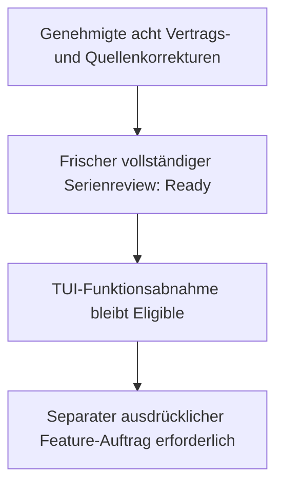

# Serien-Intake-Review nach genehmigter Reparatur / Series Intake Re-review

## Ergebnis und Freigabegrenze

Stand: 2026-10-04. Ergebnis: `Ready`. Alle 13 Mitglieder wurden erneut
inhaltlich geprüft: neun aktive Lastenhefte und vier historische Abschlüsse.
Es bleiben keine Befunde, offenen Fragen oder akzeptierten Restrisiken.
Dies ist ein Serienreview mit null Kampagnen-Workern, kein Feature-Lauf.
Identität, UTC-Zeit, Request-Bindung und alle Ziel-Hashes stehen im
[maschinenlesbaren Ergebnis](intake-review-result.json).

Thorsten genehmigte ausdrücklich die begrenzte Ergänzung der acht Verträge,
beide README-Quellbindungen, Archive, Lineage und den vollständigen Review.
MergeAndSync mit Admin-Bypass gilt nur für diese Wartungslieferung und nur für
formale Merge-Regeln. Technische, Security-, A11Y-, Evidenz- und fachliche
Reviewfehler dürfen nicht umgangen werden. Die zukünftigen Feature-Prompts
und Receipts behalten `LocalImplementation`; es wurde kein Feature gestartet.

## Aufgelöste Befunde

| ID | Auflösung ohne fachliche Erweiterung |
|---|---|
| IR003 | Security: Vorwissen, Erstgebrauchsbegriffe und vollständiger englischer Mindestanforderungs-/Abnahmevertrag ergänzt. |
| IR004 | Sandbox: Vorwissen, Mounts/Tokens/Caches und vollständiger englischer Scope-/Anforderungs-/Abnahmevertrag ergänzt. |
| IR005 | Rename: vollständige englische Anforderungen R-RN-TC-01..12, Abnahme AK-RN-TC-01..09, Entscheidungen und Workflow ergänzt. |
| IR007 | TUI: README-Delta fachlich abgeglichen; Quelle, Receipt und Supersession ausdrücklich erneuert. |
| IR008 | TUI, A11Y, PL/0, Legacy und Tabellenoperationen: Detailverträge einschließlich numerischer Schwellen, Zustands-, Sicherheits-, Abnahme- und Folgegrenzen auf Englisch ergänzt. |
| IR009 | Rename: unabhängige README-Quellbindung und Receipt-/Archiv-Lineage erneuert. |

IR001 und IR002 bleiben aufgelöst. Für IR002 bleibt der unveränderte,
gebundene Didaktik-Einzelreview gültig. Die bisherige Serien-Receipt war
strukturell gültig; ein neuer IR006-Defekt wird nicht behauptet.

Die deutsche Fassung bleibt kanonisch. Entfernen der neuen Lesehilfe und des
englischen Vertragsblocks sowie Rückumwandeln sechs gleichwertiger Markdown-
Zeilenumbrüche rekonstruiert jedes Vorgänger-Dokument byteidentisch. Auch die
ausführbaren Prompts bleiben exakt erhalten. Alte
Intakes und Receipts sind byteidentisch archiviert; neue Receipts behalten ihre
Intake-Identitäten und binden den Vorgänger als erste Quelle. Die alten geordneten
Quellinventare bleiben in den gebundenen Receipt-Archiven erhalten.

Das README-Delta besteht aus Governance-Pilot, Mermaid-/Ergebnisbericht-Regel
und Statistik-Pilot-Verweisen. Es ändert keine angebotene Produktfunktion und
keinen TUI- oder Rename-Vertrag. Beide neuen Quellen binden dieselbe aktuelle
README-Fassung. Es wurde weder ein Hash stillschweigend ersetzt noch ein
veralteter Quellennachweis als aktuell ausgegeben.

## Vollständige fachliche Serienprüfung

Für alle Mitglieder wurden Identität, Zielgruppe/Vorwissen, Erstgebrauchsbegriffe,
Ziel, Scope/Nicht-Ziele, Anforderungen, messbare Abnahme, Abhängigkeiten,
Security/Datenschutz/A11Y/Plattform/Supply Chain, Evidenz, Referenzen, Risiken,
Prompt- und Ausführungsbefugnisse sowie Textverständlichkeit geprüft.
Keine Secrets oder unnötigen personenbezogenen Daten wurden gefunden.
Die vier abgeschlossenen Mitglieder bleiben historische Nachweise, nicht
aktuelle Startbefehle. Ihre damaligen Toolversionen werden nicht neu behauptet.

Unverändert: 13 eindeutige Mitglieder, vier Wurzeln, neun harte Kanten,
zyklusfreie Reihenfolge und genau ein `Eligible`-Kandidat, TUI-Funktionsabnahme.
Hauptkette: Constitution -> Terminal.Gui -> TUI-Funktionsabnahme -> A11Y ->
Rename -> Didaktik -> Security -> PL/0 -> Legacy -> Tabellenoperationen.
Sandbox, RL-SE und GSDB sind eigene Wurzeln; RL-SE und GSDB sind abgeschlossen.
Ein kontextueller Vorgänger wird nicht als zusätzliche harte Kante erfunden.
Identitäten, Rollen, Reihenfolge, Lifecycle und Lieferbefugnisse bleiben erhalten.



Textalternative: Die genehmigte Reparatur behebt die sechs Befunde. Der frische
Serienreview ist Ready. TUI-Funktionsabnahme bleibt der nächste geeignete
Kandidat; der Review startet ihn nicht. Ein Feature braucht einen gesonderten
Auftrag. Das Diagramm ergänzt den Text und ist nicht die einzige Informationsquelle.

## Nachweise und Nichtanwendbarkeit

Publikations-Gates: beide installierten Bash-/PowerShell-Validatoren für die
acht erneuerten Receipts, Serienmanifest/-Receipt, Review-Ergebnis und Operation;
Konfiguration zuerst; gesamte Requirements-/Receipt-Ausrichtung, deterministisch
generierte Reihenfolgen, negative Governance-Fixtures; bytegenaue
Vorgänger-/Archiv-/Scope- und unveränderte DAG-/Identitäts-/Befugnisprüfung.
Ein Struktur-PASS ersetzt nicht die fachliche Prüfung der Übersetzungen.

NIST SSDF und CWE Top 25 gelten. WCAG 2.2 AA gilt für anwendbare Textkriterien;
DE-first/EN-second, B2 und text-first bleiben bindend. ASVS ist ohne Web/API
`N/A`, Zero Trust ohne verteilte Produktlaufzeit `N/A`, AI-SBOM bei reiner
KI-Entwicklungswerkzeug-Nutzung `N/A`. SBOM/VEX/SLSA bleiben Produktliefer-Gates;
STRIDE/CAPEC, SAMM, OWASP-Praxishilfen und OpenSSF Scorecard bleiben der
jeweils anwendbare Architektur-/Reifegrad-/Supply-Chain-Kontext. Diese Wartung
führt keinen neuen Produktrelease-, CVE- oder Provider-Audit aus.

PL/0-Paket-/Providerangaben bleiben datierte Snapshots, nicht neu behauptete
Live-Ergebnisse. Das zweistufige NuGet-Gate und das ProjectReference-Verbot
bleiben bindend. Lokaler Produkt-Build, Produkttests, DocFX, PTY und VoiceOver
sind für diese reine Intake-/Governance-Dokumentation ohne Produkt-, API-,
XML- oder UI-Änderung `N/A`; spätere Feature-Gates bleiben uneingeschränkt.
Provider-CI und fachliches PR-Review werden bei der Lieferung nicht umgangen.

## Audit und nächste Aktion

Dieser Review ersetzt `863726e6-5f9f-4884-8f14-d5eef9c42664`. Dessen
Request, Ergebnis und Bericht sowie Vorgänger-Manifest/-Receipt/-Reihenfolge
sind unter [20261004-language-repair](../../series-archive/tinycalc-delivery/20261004-language-repair/intake-review-result.json)
archiviert. Die Operation ist über `reviewBoundary.operationPath` gebunden.
Gültige historische Verbindungen stehen im ergänzenden
[Archiv-Wegweiser](../../series-archive/tinycalc-delivery/20261004-language-repair/README.md).
Die relativen Links der byteidentischen Altdateien behalten ihren ursprünglichen
Basispfad; der Wegweiser führt zu alten Snapshots, nicht zu neuen Verträgen.
Die genehmigte Wartungslieferung umfasst auch den unmittelbar vorausgehenden
Serienreview samt seinem unveränderten Audit-Archiv und Statistikfortschreibung.

Nächste fachliche Aktion nach der Wartungslieferung, ohne automatischen Start:

```text
$speckit-intake-series-next tinycalc-delivery
```

## English report

On 2026-10-04 the complete series re-review is `Ready`: 13 members, nine active
intakes, four historical completions and zero campaign workers. No findings,
questions or accepted risks remain. The JSON binds the identity, UTC time,
request and all target hashes. Thorsten explicitly approved these eight bounded
contract updates, both README bindings, archives, lineage and full re-review.
MergeAndSync/admin authority applies only to this maintenance delivery and only
to formal merge rules, never failed technical, security, A11Y, evidence or
substantive-review gates. Future prompts/receipts remain LocalImplementation;
no feature was started.

IR003/IR004 are resolved by prerequisites, first-use explanations and full
English security/sandbox requirements and acceptance. IR005 now has every
rename requirement, acceptance rule, decision and workflow explanation in
English. IR008 now has complete English TUI, A11Y, PL/0, Legacy and sheet-operation
contracts, including thresholds and state/security/evidence boundaries.
IR007/IR009 each have reconciled README sources and independently renewed
receipts/lineage. IR001/IR002 remain resolved, including the unchanged bound
didactic Single review. No new IR006 receipt defect is alleged.

German remains canonical. Removing the added reading guide and English contract
and reversing six equivalent Markdown hard-break spellings reconstructs each
predecessor byte-for-byte; executable prompts are
unchanged. Byte-identical predecessor targets/receipts are archived. Intake IDs
are retained; the predecessor is the first binding source; archived receipts
preserve the full prior ordered source inventory. README changes add governance
pilot, Mermaid/outcome-report rules and statistics-pilot links, not new product
functions or altered TUI/rename contracts. Both current sources bind the same
README version, with explicit approval, not a silent hash replacement.

All members were reviewed for identity, audience/prerequisites, terms, purpose,
scope/non-goals, requirements, measurable acceptance, dependencies, security,
privacy, accessibility, platforms, supply chain, evidence, references, risks,
prompts, authority and text readability. No secrets/unnecessary personal data
were found. Completed members are historical proof, not current commands or
new tool-version claims. The same 13 members, four roots, nine hard edges,
acyclic order and one Eligible TUI candidate remain. The main chain is
Constitution -> Terminal.Gui -> TUI acceptance -> A11Y -> rename -> didactic ->
security -> PL/0 -> Legacy -> sheet operations. Sandbox, completed RL-SE and
completed GSDB are independent roots; contextual sequencing adds no hard edge.
Identities, roles, lifecycle, order and future delivery authority are unchanged.

Text alternative to the diagram: the approved repair resolves six findings;
the new series review is Ready; TUI remains Eligible. Neither starts a feature.
A separate explicit feature mandate is still required.

Publication gates cover both installed validator paths for eight renewed
receipts, manifest/receipt/review/operation; configuration first; complete
requirements/receipt alignment, generated ordering and negative fixtures;
byte-exact predecessor/archive/scope and unchanged DAG/identity/authority proof.
Structural PASS does not substitute for semantic translation review.
SSDF/CWE apply; applicable WCAG 2.2 AA, German-first/English-second, B2 and
text-first apply. ASVS is N/A without web/API, Zero Trust N/A without distributed
runtime, AI-SBOM N/A for development-tool-only AI. SBOM/VEX/SLSA remain product
delivery gates; STRIDE/CAPEC/SAMM/OWASP guidance/Scorecard remain applicable
context, not fresh release/CVE/provider-audit claims. PL/0 dated snapshots,
two-stage NuGet gate and no-ProjectReference rule remain unchanged. Local product
build/tests/DocFX/PTY/VoiceOver are N/A for this documentation-only change, not
waived for future features. Delivery still requires provider CI and substantive
PR review. The prior review and series artifacts are archived at the linked
20261004-language-repair path; JSON binds the operation and superseded review.
Next after maintenance delivery: `$speckit-intake-series-next tinycalc-delivery`.

Use the linked archive navigation for historical contracts and superseded review
evidence. Original relative links retain their former base; the companion maps
old snapshots without rewriting hash-bound archive bytes.
