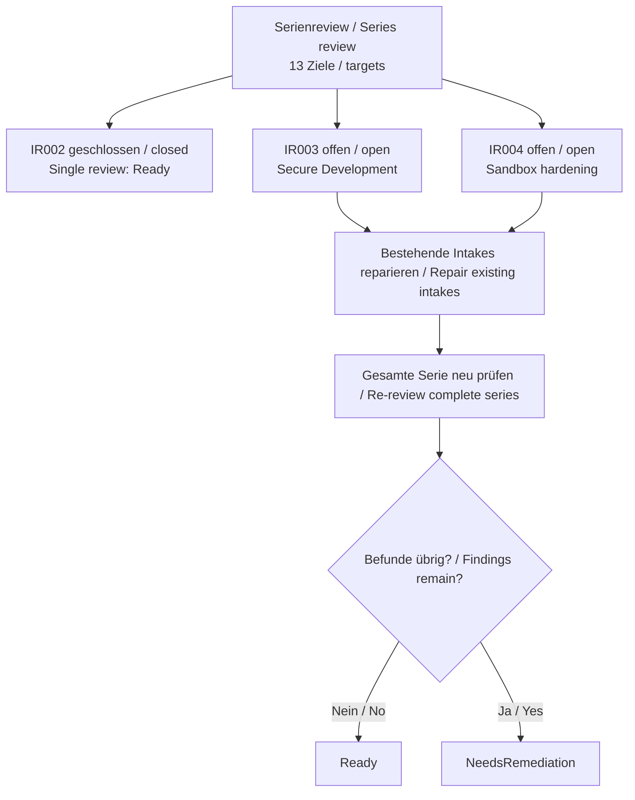

# TinyCalc Delivery Intake Series Review

## Ergebnis / Outcome

Deutsch:
Der vollstaendige Serienreview endet mit **NeedsRemediation**. Alle 13 Zielhashes, vier Wurzeln und neun verbindlichen Hard Gates sind aktuell und konsistent. Genau ein Ziel ist `Eligible`; dieser Status waehlt nur den naechsten Kandidaten und erteilt keine Ausfuehrungs- oder Delivery Authority.

English:
The complete series review ends with **NeedsRemediation**. All 13 target hashes, four roots, and nine binding hard gates are current and consistent. Exactly one target is `Eligible`; this status only selects the next candidate and grants no execution or delivery authority.

## Befunde / Findings

| ID | Schwere / Severity | Ziel / Target | Ergebnis / Disposition |
|---|---|---|---|
| `IR003` | Medium | `Lastenheft_Secure-Development-Hardening.md` | Vorkenntnisse, Sicherheitserstbegriffe und gleichwertige englische Normativabschnitte fehlen weiterhin. / Prior knowledge, first-use security terms, and equivalent English normative sections are still missing. |
| `IR004` | Medium | `Lastenheft_Sandbox-gestuetzte-Secure-Development-Haertung.md` | Vorkenntnisse, Sandbox-Erstbegriffe und gleichwertige englische Anforderungen und Abnahmeregeln fehlen weiterhin. / Prior knowledge, first-use sandbox terms, and equivalent English requirements and acceptance rules are still missing. |

`IR002` ist geschlossen. Der Ready-Single-Review `f560c480-9160-463a-b2c3-bba5ba5d776b` bindet das aktualisierte Didactic-Intake mit Hash `460abc8142179cc40e1d0cfe07928260456088205b3200e7ca6c6e10818e46da`.

*`IR002` is closed. Ready Single review `f560c480-9160-463a-b2c3-bba5ba5d776b` binds the updated Didactic intake with hash `460abc8142179cc40e1d0cfe07928260456088205b3200e7ca6c6e10818e46da`.*

## Textorientierter Ablauf / Text-First Flow

Deutsch:
Der Serienreview umfasst 13 Ziele. `IR002` ist geschlossen. `IR003` und `IR004`
bleiben als mittlere Befunde in ihren bereits vorhandenen Intake-Dateien offen.
Diese beiden Dateien werden korrigiert; anschließend wird die vollständige Serie
erneut geprüft. Nur ein Review ohne verbleibende Befunde kann den Status `Ready`
erreichen. Bleiben Befunde offen, bleibt der Status `NeedsRemediation`.

English:
The series review covers 13 targets. `IR002` is closed. `IR003` and `IR004`
remain open as Medium findings in their existing intake files. Those two files
will be repaired, and then the complete series will be reviewed again. Only a
review without remaining findings can reach `Ready`. If findings remain, the
status remains `NeedsRemediation`.

## Abdeckung und Grenzen / Coverage and Boundaries

Es wurden 13 Ziele und keine Worker geprueft. Befunde: 0 Critical, 0 High, 2 Medium und 0 Low. Es gibt keine akzeptierten Risiken und keine offenen Fragen. Schema-2.0-Konfiguration, BCP-47-Sprache, Namensprofil, vier Rollen, sechs Collections, Receipt-/Zielhashes, DAG, Lifecycle, Handoffs, Security, Privacy, A11Y, Plattform, Supply Chain, Evidence, Prompt-Grenzen und textbasierte Zugaenglichkeit wurden geprueft. Der Review startet kein Feature und erteilt keine Remote-Berechtigung.

*Thirteen targets and no workers were reviewed. Findings: 0 Critical, 0 High, 2 Medium, and 0 Low. There are no accepted risks or open questions. The schema-2.0 configuration, BCP-47 language, naming profile, four roles, six collections, receipt and target hashes, DAG, lifecycle, handoffs, security, privacy, accessibility, platform, supply chain, evidence, prompt boundaries, and text-first accessibility were reviewed. This review starts no feature and grants no remote authority.*

## Naechste Aktion / Next Action

`$speckit-intake-repair requirements/intakes/series/tinycalc-delivery/intake-review-result.json`
