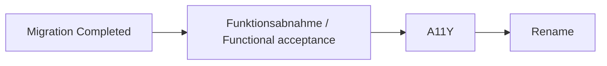

# Feature-Spezifikation: TUI-Funktionsabnahme und Regressionsvertrag / Feature Specification: TUI Functional Acceptance and Regression Contract

**Feature Branch:** `006-tui-functional-contract`
**Erstellt / Created:** 2026-10-07
**Status:** Draft — fachliche Klärung und Anforderungsreview abgeschlossen; Owner-Scope-Entscheidung dokumentiert, PR-Review ausstehend. Keine Implementierungsfreigabe. / Functional clarification and requirements review complete; owner scope recorded, PR review pending. No implementation authority.
**Auftrag / Input:** Vollständiges verbindliches Intake in eine Feature-Spezifikation überführen; ausschließlich Spezifikation, keine Implementierung oder Lieferung. / Convert the complete binding intake into a feature specification; specification only, without implementation or delivery.

Verbindliche Quelle ist [das TUI-Intake](../../requirements/intakes/active/Lastenheft_TUI-Funktionsabnahme-und-Regressionsvertrag.md), normalisierter SHA-256 `c07016800b9e02e56f123ed6af187d0b5fedd22c1689a1b8909fcc6e8f70c6ac`. Ausgangscommit: `0ed043f720386240235010ad0249368244ed26aa`. Serie: `5b4523b4-d946-4091-9cbc-11825af94332`, Position 3, `Eligible`; harter Vorgänger Terminal.Gui-Migration `Completed`. Review `192a2219-0b1e-4a71-a336-502848cf10b0` ist `Ready` mit 13 gebundenen Zielen und null Befunden. Diese Werte wurden beim Specify-Aufruf mit Bash und PowerShell geprüft. Spätere Arbeit muss ihre Aktualität erneut prüfen.

*The binding source is the linked TUI intake with the hash above. At specification time, the thirteen-target series review is Ready with no findings, this intake is Eligible at position three, and its migration predecessor is Completed. Bash and PowerShell validate these bindings; later work must recheck freshness.*

## Clarifications / Klärungen

### Session 2026-10-07 — ursprünglicher Clarify-Lauf / Original clarification run

- Q: Dürfen manuelle Nachweise automatisierbare funktionale Bedienwege ersetzen? → A: Nein. Automatisierbare Funktionswege müssen automatisiert geprüft werden; manuelle Nachweise ergänzen nur Prüfungen, die menschliche Bedienung oder Wahrnehmung benötigen. / Q: May manual evidence replace automatable functional paths? → A: No. Automatable functional paths require automated tests; manual evidence supplements only checks requiring human interaction or perception.
### Session 2026-10-07 — Anforderungsnachprüfung / Requirements follow-up

- Q: Welche Bedeutung soll `/` im Raster und im Editor haben? → A: Option A. Im Tabellenraster öffnet `/` die Palette; im geöffneten Editor ist `/` normales Eingabezeichen. Andere druckbare ASCII-Zeichen starten vom Raster aus die Bearbeitung. / Q: What does slash mean in the grid and editor? → A: Option A. Slash opens the palette in the grid and remains literal input in the open editor; other printable ASCII characters start editing from the grid.
- Q: Wie sollen zusätzliche historische Hilfeangebote behandelt werden? → A: Option A. Alle angebotenen Funktionen und Tasten bleiben Vertragsbestandteil und werden kontextabhängig zugeordnet: Ctrl-G im Raster zusätzlich rechts, im Editor Zeichen rechts löschen; `/` öffnet im Raster die Palette und zeichnet die Anzeige neu. Historische Editorfunktionen und Aliase bleiben Pflicht. / Q: How are additional historical help offers handled? → A: Option A. Preserve every offered function and key with context-specific meaning: Ctrl-G moves right in the grid and deletes the character to the right in the editor; grid slash opens the palette and redraws the display. Preserve historical editor functions and aliases.

- Q: Welche Argumente akzeptiert `FACT`? → A: Option A. Nur ganze Zahlen von 0 bis 33; `FACT(0)=1`. Nichtganzzahlige, negative und größere Argumente ergeben einen verständlichen Fehler; keine Abschneidung gegen null. / Q: Which arguments does FACT accept? → A: Option A. Integers from 0 to 33 only; FACT(0)=1. Fractional, negative and larger arguments produce a clear error without truncation.

- Q: Welche Bindungsregeln gelten für Potenzen und Vorzeichen? → A: Option A. Potenzketten binden rechts und Potenzen stärker als vorangestellte Vorzeichen: `2^3^2=512`, `-2^2=-4`, `(-2)^2=4`, `2^-2=0.25`. Klammern haben Vorrang. / Q: How do powers and signs bind? → A: Option A. Power chains bind right and powers bind more strongly than leading signs: 2^3^2=512, -2^2=-4, (-2)^2=4, 2^-2=0.25. Parentheses take precedence.

- Q: Wie werden numerische Definitionsfehler und nichtendliche Ergebnisse behandelt? → A: Option A. Nur endliche reelle Ergebnisse; Definitionsfehler, Überläufe und NaN/Unendlich ergeben verständliche Fehler statt erfolgreicher numerischer Zellwerte. SQRT(-1), LN(0), (-1)^0.5 und EXP(1000) müssen verständlich scheitern. / Q: How are numeric domain errors and non-finite results handled? → A: Option A. Only finite real results; domain failures, overflow and NaN/infinity produce clear errors instead of successful numeric cell values. The four listed cases must fail clearly.

### Session 2026-10-08 / Sitzung 2026-10-08

- Q: Welche Winkeleinheit gilt für SIN, COS und ARCTAN? → A: Option A. SIN/COS erhalten Bogenmaß, ARCTAN liefert Bogenmaß; SIN(π/2)=1 und ARCTAN(1)=π/4. π bezeichnet den mathematischen Wert, keine neue Formelsyntax. / Q: Which angle unit applies to SIN, COS and ARCTAN? → A: Option A. SIN/COS take radians and ARCTAN returns radians; SIN(π/2)=1 and ARCTAN(1)=π/4. π is a mathematical value, not new formula syntax.

- Q: Welche Basen verwenden LN und LOG? → A: Option A. LN zur Basis e, LOG zur Basis 10; LN(EXP(1))≈1 und LOG(100)=2. Argumente ≤ 0 ergeben einen verständlichen Fehler. / Q: Which bases do LN and LOG use? → A: Option A. LN uses base e and LOG base 10; LN(EXP(1))≈1 and LOG(100)=2. Arguments ≤ 0 produce a clear error.

- Q: Wie behandelt ROUND zu große Präzisionsangaben? → A: Option A. Nichtnegative Angaben gegen null abschneiden; danach 0 bis 15 zulassen, größere Werte als verständlichen Fehler ablehnen. 15.9 wird 15, 16 ergibt Fehler. Negative Rohargumente bleiben Fehler; Halbwerte werden weg von null gerundet. / Q: How does ROUND handle excessive precision? → A: Option A. Truncate nonnegative precision toward zero, then accept 0–15; reject larger values with a clear error. 15.9 becomes 15, 16 fails. Negative raw arguments fail; midpoint rounding remains away from zero.

## Nutzungsszenarien und Prüfung / User Scenarios & Testing

Zielgruppe sind TinyCalc-Anwendende, Auszubildende ab dem ersten Ausbildungsjahr, Lehrende und Reviewer. Grundlegende Tabellenbedienung genügt. Ein Produktvertrag ist eine versionierte Liste aller angebotenen Funktionen mit stabilen Kennungen (IDs) und zugehörigen Nachweisen. Drift ist eine unbeabsichtigte Abweichung zwischen Produkt, Hilfe, Dokumentation und Vertrag. Ein PTY ist ein Pseudoterminal für die Bedienung einer echten Terminalanwendung. Ein Gate ist eine verpflichtende Prüfschranke; ein Pin legt eine konkrete Abhängigkeitsversion fest. `Specify` beschreibt Anforderungen; Planung und Implementierung sind spätere getrennte Schritte. `Eligible` bedeutet auswählbar, keine Startfreigabe.

*The audience includes users, first-year apprentices, teachers and reviewers. Basic spreadsheet skills are sufficient. A product contract lists offered capabilities, stable IDs and proof. Drift means disagreement between product, help, documentation and contract. A PTY supports real terminal interaction; a gate is a mandatory checkpoint and a pin selects an exact dependency version. Specify records requirements; planning and implementation are separate later steps. Eligible means selectable, not authorised to start.*

### US-001 — Tabelle über jeden angebotenen Weg bedienen / Use every offered spreadsheet path (P1)

Anwendende starten die Anwendung, bewegen sich mit allen angebotenen Tasten, bearbeiten Zellen und lösen dokumentierte Berechnungen aus. Sie erhalten vorhersehbare Ergebnisse und verständliche Fehler. Priorität P1 schützt die vollständige vorhandene Bedienbarkeit. Unabhängige Prüfung: Jede Baseline-Familie und jeder Alias wird anhand definierter Ausgangsdaten einzeln ausgeführt; Erwartung und sichtbarer Zustand werden verglichen.

*Users start the application, use every offered navigation key, edit cells and calculate documented formulas. Results are predictable and errors understandable. P1 protects existing usability. Independently exercise every baseline family and alias from defined input and compare expected results and visible state.*

1. **Gegeben / Given:** ein gestartetes Raster / a running grid. **Wenn / When:** jeder Navigationsalias an einer Innen- und Randzelle verwendet wird / each alias is used at an interior and edge cell. **Dann / Then:** Auswahl und Status stimmen; Randnavigation bleibt im Raster / selection and status agree and navigation stays inside the grid.
2. **Gegeben / Given:** ein bekannter Zellinhalt / known cell content. **Wenn / When:** Bearbeitung bestätigt oder abgebrochen wird / editing is confirmed or cancelled. **Dann / Then:** nur Bestätigung übernimmt den neuen Inhalt; Abbruch erhält Inhalt und Zustand / only confirmation applies the new value; cancellation preserves content and state.
3. **Gegeben / Given:** jede dokumentierte Funktion, Operator- und Referenzform / each documented function, operator and reference form. **Wenn / When:** Eingabe über den echten Zelleditor erfolgt / entered through the actual cell editor. **Dann / Then:** Formeltyp, Ergebnis oder erwarteter Fehler stimmen mit dem Vertrag überein / formula type, result or expected error agrees with the contract.

### US-002 — Dateien, Dialoge und Hilfe zuverlässig nutzen / Reliably use files, dialogs and help (P1)

Anwendende speichern, laden, drucken und formatieren; sie können Dialoge ohne Teilwirkung abbrechen und Hilfe über jeden angebotenen Weg lesen. P1 schützt Daten und Lernzugang. Unabhängige Prüfung: definierte Datei-Rundreise, Textdruck und alle Dialog-/Hilfepfade mit synthetischen Daten.

*Users save, load, print and format, cancel dialogs without partial changes and read help through every offered path. P1 protects data and learning access. Independently test a defined file round trip, text printing and every dialog/help path with synthetic data.*

1. **Gegeben / Given:** eine Tabelle mit allen Zelltypen / a sheet with every cell type. **Wenn / When:** sie gespeichert und erneut geladen wird / saved and reloaded. **Dann / Then:** Inhalt und vertraglich gespeicherte Eigenschaften bleiben gleich / content and contractually persisted properties agree.
2. **Gegeben / Given:** Editor, Load, Save, Print, Format, Clear oder Palette / any listed dialog. **Wenn / When:** Abbruch erfolgt / cancelled. **Dann / Then:** keine unbeabsichtigte Zell-, Datei- oder Zustandsänderung tritt ein / no unintended cell, file or state change occurs.
3. **Gegeben / Given:** verfügbare beziehungsweise fehlende/beschädigte Hilfe / available or missing/damaged help. **Wenn / When:** Öffnen, Blättern und Schließen versucht wird / opening, paging and closing are attempted. **Dann / Then:** alle Wege funktionieren oder liefern den erwarteten verständlichen Fehler ohne Terminalschaden / all paths work or show the expected clear error without damaging terminal state.

### US-003 — Vollständigkeit und Drift erkennen / Detect completeness and drift (P1)

Reviewer können jede angebotene Funktion einer stabilen ID und gültiger Evidenz zuordnen. P1 verhindert unbelegte Abschlussbehauptungen. Unabhängige Prüfung: aktive IDs und Oberflächen abgleichen, danach gezielt Dokumentations- und Testdrift einbringen.

*Reviewers can map every offered capability to stable IDs and valid evidence. P1 prevents unsupported completion claims. Independently compare active IDs and surfaces, then deliberately introduce documentation and test drift.*

1. **Gegeben / Given:** vollständige Baseline / the complete baseline. **Wenn / When:** Pflicht-ID, Alias oder Nachweis fehlt, doppelt, veraltet oder unbelegt ist / a mandatory ID, alias or proof is missing, duplicated, stale or unsupported. **Dann / Then:** Abnahme und Merge bleiben gesperrt mit konkretem Befund / acceptance and merge remain blocked with a specific finding.
2. **Gegeben / Given:** substantielle Angebote und eindeutige Textfehler / substantive offers and clear text errors. **Wenn / When:** Konflikte bewertet werden / conflicts are assessed. **Dann / Then:** Angebote bleiben Vertrag; zusätzliche COUNT-Backticks und historische Beispiele außerhalb des Rasters werden als Dokumentationsdefekte erfasst / offered behaviour remains contractual; extra COUNT backticks and historical out-of-grid examples are documentation defects.
3. **Gegeben / Given:** nur erfolgreiche Builds, Unit-Tests oder Smoke / successful build, unit tests or smoke only. **Wenn / When:** Abschluss bewertet wird / completion is assessed. **Dann / Then:** fehlende Gesamtvertrags- oder Plattformnachweise verhindern vollständige Abnahme / missing complete-contract or platform proof prevents full acceptance.

### US-004 — Spätere Änderungen sicher einordnen / Classify later changes safely (P2)

Entwickelnde erweitern den Vertrag additiv und erhalten die bisherigen Nachweise. P2 macht die Erstabnahme dauerhaft wirksam. Unabhängige Prüfung: unveränderten Pin, Versionsdrift, fehlenden Pin, jede Impact-Klasse und eine neue Anforderung getrennt bewerten.

*Developers extend the contract additively and preserve existing proof. P2 makes initial acceptance durable. Independently assess unchanged pins, drift, missing pins, each impact class and a new requirement.*

1. **Gegeben / Given:** ein unveränderter freigegebener Pin mit passender Evidenz / unchanged approved pin with matching evidence. **Wenn / When:** Preflight läuft / preflight runs. **Dann / Then:** Wiederverwendung ist nur mit gebundener Evidenz zulässig / reuse requires bound evidence.
2. **Gegeben / Given:** Versionsdrift oder fehlender/gleitender Pin / version drift or a missing/floating pin. **Wenn / When:** Preflight läuft / preflight runs. **Dann / Then:** Drift verlangt vollständige Kompatibilitäts-, PTY- und A11Y-Prüfung; fehlender/gleitender Pin blockiert Implementierung; kein automatisches Upgrade erfolgt / drift requires full compatibility, PTY and accessibility proof; missing/floating pins block implementation; no automatic upgrade occurs.
3. **Gegeben / Given:** eine neue Funktion oder unklarer Impact / a new feature or unclear impact. **Wenn / When:** Änderungen vorbereitet werden / changes are prepared. **Dann / Then:** neue IDs und rote Tests entstehen vor Produktcode; unklarer Impact löst die volle funktionale und A11Y-Matrix aus / new IDs and failing tests precede product code; unclear impact triggers the full functional and accessibility matrix.

### Grenzfälle / Edge Cases

- Rastergrenzen `A1:G21`, jede Richtungsalias-Taste, reale Größe `80x24` und dokumentierte größere Größe. / Grid edges, every direction alias and real minimum/larger documented terminal sizes.
- Leere, textuelle, numerische, formelhaltige und gesperrte Zellen; Statusflags, Textüberlauf, Feldbreite und Dezimalstellen. / Empty, text, numeric, formula and locked cells; flags, overflow, width and decimals.
- Ungültige Syntax, Definitions-/Grenzfehler jeder Funktion, leere/textuelle Referenzen und Zyklen. / Invalid syntax, function domain/boundary errors, empty/text references and cycles.
- Fehlende/ungültige Dateien, fehlende/beschädigte Hilfe und Abbruch jedes Dialogs. Vorhandene Daten und Terminalzustand bleiben geschützt. / Missing/invalid files and help, cancellation of every dialog; protect existing data and terminal state.
- Veraltete Plattform-, Pin- oder Vertragsnachweise und absichtlich geschwächte Tests müssen blockieren. / Stale platform, pin or contract evidence and deliberately weakened tests must block.
- Unklare Dokumentationskonflikte bleiben offen, bis Produkt, Dokumentation, Hilfe, Vertrag und Evidenz übereinstimmen. / Unclear documentation conflicts stay open until all product and evidence surfaces agree.

## Anforderungen / Requirements

### Umfang, Quellen und Nicht-Ziele / Scope, Sources and Non-Goals

Der Umfang ist die Vereinigungsmenge aus TUI, `README.md`, gebündelter Laufzeithilfe und migrierter Hilfe. Die folgende Baseline steht bereits fest; Discovery darf sie ergänzen, niemals verkleinern. Jeder aufgeführte Alias wird einzeln ausgeführt, auch bei gemeinsamer ID. Substantielle Angebote dürfen nur nach FR-014 entfernt werden. Eindeutige Tipp-, Syntax- und Rasterfehler erzeugen keine neue Semantik. Widersprüche blockieren bis zur vollständigen Angleichung.

*Scope is the union of the TUI, README, bundled runtime help and migrated help. The following baseline is fixed; discovery may only add to it. Exercise every listed alias even when IDs are shared. Substantive removal requires FR-014 approval. Clear spelling, syntax and grid mistakes create no new semantics. Conflicts block until all surfaces agree.*

| ID-Familie / Family | Vollständiger verbindlicher Umfang / Complete binding scope |
|---|---|
| `APP-*` | Interaktiver Start, `--smoke` mit `SMOKE_OK` oder erklärtem `SMOKE_FAIL`, geordnetes Beenden, Terminalwiederherstellung. / Interactive start, smoke success or explained failure, orderly exit, terminal restoration. |
| `GRID-*` | `A1:G21`, Zeilen-/Spaltenköpfe, sichtbare aktive Zelle, Zelltyp-/AutoCalc-Status, begrenzte Randnavigation. / Grid, headers, visible active cell, type/AutoCalc status, bounded edge navigation. |
| `NAV-UP-*` | Pfeil hoch, `Ctrl-E`. / Up arrow, Ctrl-E. |
| `NAV-DOWN-*` | Pfeil runter, `Ctrl-X`, `Ctrl-J`. / Down arrow, Ctrl-X, Ctrl-J. |
| `NAV-RIGHT-*` | Pfeil rechts, `Ctrl-D`, `Ctrl-M`, `Enter`; zusätzlich `Ctrl-G` aus der genehmigten additiven Help-Discovery. / Right arrow, Ctrl-D, Ctrl-M, Enter and the additional approved Ctrl-G help alias. |
| `NAV-LEFT-*` | Pfeil links, `Ctrl-S`, `Ctrl-A`. / Left arrow, Ctrl-S, Ctrl-A. |
| `EDIT-*` | `Esc` öffnet bestehenden Inhalt; im Raster starten druckbare ASCII-Zeichen außer dem Palettenkommando `/` neue Eingabe; im geöffneten Editor sind alle druckbaren ASCII-Zeichen einschließlich `/` Eingabetext. Dialog-`Enter` bestätigt, Dialog-`Esc` bricht unverändert ab. / Esc edits existing content; printable ASCII other than the slash palette command starts new input from the grid. In the open editor all printable ASCII, including slash, is literal input. Dialog Enter confirms and Esc cancels without change. |
| `CELL-*` | Leer/Text/Zahl/Formel, Statusflags, Textüberlauf, Feldbreite, Dezimalstellen, gesperrte Zellen, verständliche Fehler. / Empty/text/number/formula, flags, overflow, width, decimals, locked cells and clear errors. |
| `OP-*` | Unäre Vorzeichen, Klammern, `+`, `-`, `*`, `/`, `^`. / Unary signs, parentheses and all listed operators. |
| `REF-*` | Einzelreferenz, rechteckige Bereichssumme mit `>`, leere/textuelle Zellen, Zykluserkennung. / Single reference, rectangular sum with >, empty/text cells, cycle detection. |
| `FUNC-LEGACY-*` | `ABS`, `SQRT`, `SQR`, `SIN`, `COS`, `ARCTAN`, `LN`, `LOG`, `EXP`, `FACT`. / Every listed legacy function. |
| `FUNC-EXT-*` | `MIN`, `MAX`, `AVERAGE`, `COUNT`, `IF`, `ROUND`, jeweils dokumentierte Grenz-/Fehlerfälle. / Every listed extended function with documented boundary/error cases. |
| `CMD-*` | `Load`, `Save`, `Recalculate`, `Print`, `Format`, `AutoCalc`, `Help`, `Clear`, `Quit` jeweils über Menü und Palette; `Ctrl-Q` beendet, `/` öffnet Palette. / Each command through both menu and palette; Ctrl-Q quits and / opens palette. |
| `FILE-*` | JSON-Save/Load-Rundreise, fehlende/ungültige Dateien, Textdruck mit Randangabe, Abbruch jedes Dateidialogs. / JSON round trip, missing/invalid files, text printing with margin, cancellation of every file dialog. |
| `HELP-*` | Gebündelte Hilfe, Blättern mit `P`/`N` und Buttons, Schließen mit `Esc`/Button, fehlende/beschädigte Ressource. / Bundled help, paging with P/N and buttons, close with Esc/button, missing/damaged resource. |
| `DIALOG-*` | Editor, Load, Save, Print, Format, Clear und Palette: Bestätigen/Abbrechen ohne unbeabsichtigte Teilwirkung. / Confirm/cancel every listed dialog without unintended partial effects. |
| `TERM-*` | Reale `80x24`- und dokumentierte größere Größe, Fokus-/Kontrastzustände, dieselben sichtbaren PTY-Texte. / Real minimum and documented larger size, focus/contrast states, matching visible PTY text. |

Die zweite Nutzerantwort A erhält die zusätzlichen historischen Editierangebote innerhalb EDIT: Ctrl-S/Ctrl-D bewegen links/rechts; Ctrl-A/Ctrl-F bewegen zum Anfang/Ende der Eingabe; DEL/Ctrl-G löschen das linke/rechte Zeichen; Ctrl-V und Ins schalten Einfügen/Überschreiben. Die dokumentierten Einzelbuchstaben Q/L/S/R/P/F/A gehören zur Befehlsauswahl, nicht zur Rastertexteingabe. Jeder angebotene Alias benötigt einen eigenen Kontextpfad; kein neuer ID-Familienbereich und keine historische Scancode-Emulation werden eingeführt. Raster-`/` verbindet Neuzeichnen mit Palettenöffnung, Editor-`/` bleibt Texteingabe.

*The second answer A preserves historical editor navigation, home/end, left/right deletion and insert/overwrite aliases within EDIT. Q/L/S/R/P/F/A belong to command selection, not grid input. Each alias has its own contextual path; no new family or historical scancode emulation is introduced. Grid slash redraws and opens the palette, while editor slash remains literal input.*

Nicht-Ziele sind PL/0, interner MicroCalc/TinyCalc-Rename, `.MCS`-Import, Formelkopie, Zeilen-/Spalteneinfügen oder -löschen, DOS-/CP/M-/IBM-Scancode-Emulation, automatische Latest-Upgrades und eine Behauptung von 100 Prozent Zeilenabdeckung.

*Non-goals are PL/0, internal rename, MCS import, formula copy, structural row/column operations, historical platform/scancode emulation, automatic latest-version upgrades and a 100% line-coverage claim.*

### Funktionale Anforderungen / Functional Requirements

Die FR-Kennungen bleiben identisch zum Intake. Konkrete Vertrags-IDs werden später innerhalb der unveränderten Familien vergeben; diese Spezifikation erzeugt noch keinen ausführbaren Produktvertrag.

*FR identifiers retain their intake meaning. Later contract IDs belong to the unchanged families; this specification does not create the executable contract.*

- **FR-001:** Der Produktvertrag muss stabile, nie wiederverwendete IDs, Status, Oberfläche, Plattform, erwartetes Ergebnis und Evidenzart enthalten. / The contract must contain stable never-reused IDs, status, surface, platform, expected outcome and evidence kind.
- **FR-002:** Jede aktive Funktion aus TUI, README, Laufzeithilfe oder migrierter Hilfe muss einer oder mehreren Vertrags-IDs zugeordnet sein. / Map every active capability on any offered surface to one or more contract IDs.
- **FR-003:** Jede aktive Pflicht-ID muss gültige Evidenz besitzen. Jeder automatisierbare funktionale Bedienweg benötigt einen automatisierten ausführbaren Test. Ausdrücklich begründete manuelle Nachweise ergänzen ausschließlich Prüfungen, die menschliche Bedienung oder Wahrnehmung benötigen, insbesondere reale Terminal-/VoiceOver-Bewertung; sie ersetzen keine automatisierbare Funktionsregression. / Every mandatory active ID requires valid evidence. Each automatable functional path needs an automated executable test. Explicitly justified manual evidence supplements only checks requiring human interaction or perception, especially real-terminal/VoiceOver assessment; it cannot replace automatable functional regression.
- **FR-004:** Fehlende, doppelte, veraltete oder unbelegte Pflicht-IDs müssen den Merge blockieren. / Missing, duplicate, stale or unsupported mandatory IDs must block merge.
- **FR-005:** Alle Navigations-, Editier-, Formel-, Befehls-, Datei-, Druck-, Format-, Clear- und Hilfewege müssen erfolgreich abgenommen werden. / Accept every navigation, editing, formula, command, file, print, format, clear and help path.
- **FR-006:** Jeder Dialog muss Bestätigung und Abbruch ohne unbeabsichtigte Nebenwirkung unterstützen. / Every dialog must support confirm/cancel without unintended effects.
- **FR-007:** Alle dokumentierten Formelfunktionen müssen über echte Zellbearbeitung als Formeln erkannt und ausgewertet werden. / Recognise and evaluate all documented functions through actual cell editing.
- **FR-008:** Regression muss Linux und Windows automatisiert abdecken und macOS durch den definierten PTY-Pfad belegen. / Automate Linux and Windows regression and provide defined macOS PTY proof.
- **FR-009:** Änderungen müssen den fünf Impact-Klassen zugeordnet sein; unklarer Impact gilt als `FunctionalImpact + A11yImpact`. / Classify changes in the five impact classes; uncertainty triggers full functional plus accessibility impact.
- **FR-010:** Vor TUI-Features muss Preflight den aktuell freigegebenen Terminal.Gui-Pin und seine Deklarations-/Lockquellen ermitteln. / Before TUI features, resolve the current approved Terminal.Gui pin and declaration/lock sources.
- **FR-011:** Unveränderter Pin erlaubt nur evidenzgebundene Wiederverwendung; Versionsdrift verlangt vollständige Kompatibilitäts-, PTY- und A11Y-Prüfung. / Unchanged pins permit only evidence-bound reuse; drift requires full compatibility, PTY and accessibility proof.
- **FR-012:** Fehlende oder gleitende Pins blockieren Implementierung; Preflight führt kein Upgrade aus. / Missing/floating pins block implementation; preflight must not upgrade.
- **FR-013:** Neue Features müssen vor Produktcode neue Vertrags-IDs und rote Tests ergänzen; bisherige aktive IDs bleiben regressionspflichtig. / New features add IDs and failing tests before product code and retain all active regression obligations.
- **FR-014:** Entfernung verlangt ausdrücklich genehmigten Deprecation-/Breaking-Change-Nachweis. / Removal requires explicitly approved deprecation or breaking-change evidence.
- **FR-015:** Die vollständige Baseline muss in den maschinenlesbaren Vertrag überführt werden; Discovery darf sie nur ergänzen. / Transfer the entire baseline to the machine-readable contract; discovery may only add.
- **FR-016:** Vertrags-/Driftprüfung muss bekannte Dokumentationsdefekte getrennt von fachlichen Anforderungen ausweisen. / Separate known documentation defects from product-contract violations.
- **FR-017:** Jede neue Feature-Anforderung ergänzt vor Produktcode eindeutige Vertrags-IDs und ordnet Erfolgs-, Abbruch- und Fehlerfälle einer Impact-Klasse zu. / Every new requirement adds unique IDs and classifies success, cancellation and error paths before code.

### Verfassungsanforderungen / Constitution Requirements

- **CR-001:** Die TinyCalc-Zeile in `constitution.md` und `.specify/memory/constitution.md` ist bindend: .NET 10/C#, `MicroCalc.sln`, xUnit, TUI-Smoke, DocFX-A11Y und Statistikbasen 80/125 Zeilen je Arbeitstag. / Use the binding TinyCalc registry environment and documented manual baselines.
- **CR-002:** WCAG 2.2 AA gilt für anwendbare Kriterien; Tastatur, Fokus, Kontrast, Fehler und vollständige Textalternativen werden belegt. / Apply relevant WCAG AA criteria and prove keyboard, focus, contrast, errors and textual alternatives.
- **CR-003:** Nutzer-/Lerntexte sind DE-first/EN-second auf CEFR B2, Begriffe werden erklärt, Spec-Kit-Vorwissen wird nicht vorausgesetzt. / Deliver accessible bilingual B2 text with first-use explanations and no assumed Spec Kit knowledge.
- **CR-004:** Spätere Umsetzung aktualisiert Statistik; dieser ausdrücklich begrenzte Specify-Lauf verändert nur Spezifikation, zugehörige Qualitätscheckliste und Feature-Zeiger. Gemeinsame Agentenregeln bleiben unberührt. / Implementation updates statistics; this bounded Specify run writes only the spec, quality checklist and feature pointer; shared agent rules remain untouched.
- **CR-005:** C# ist speichersicher; Microsoft-Secure-Coding-Regeln bleiben anwendbar, besonders Eingabe, sichere Deserialisierung, Datei-I/O und Fehlerausgabe. / C# is memory-safe; secure coding remains required at input, deserialisation, file I/O and error boundaries.
- **CR-006:** Die unten dokumentierten Anwendbarkeiten und Evidenzpfade gelten; NIST SSDF/CWE Top 25 sind zwingend. / Apply the recorded standards/evidence decisions; SSDF and CWE Top 25 are mandatory.
- **CR-007:** ASVS ist für lokale TUI ohne Web/API/HTTP-/Auth-Dienst `N/A`; neue Dienste lösen Neubewertung aus. / ASVS is N/A for this local TUI; new services trigger reassessment.
- **CR-008:** SBOM, bedingtes VEX und SLSA-Herkunft sind bei verteilbaren Artefakten im Supply-Chain-Nachweis gebunden. / Bind component inventories, conditional vulnerability disposition and provenance for distributed artefacts.
- **CR-009:** KI dient nur als Entwicklungswerkzeug; Produkt-AI-SBOM ist `N/A`, bei KI-Runtime neu zu bewerten. / AI is development tooling only; product AI-SBOM is N/A unless runtime AI is introduced.
- **CR-010:** Bestehende Tastatur-/Formel-, Datei-, Hilfe-, Dependency- und Evidenzgrenzen werden mit STRIDE/CAPEC geprüft; Zero Trust ist für das lokale Produkt `N/A`. / Assess existing input, file, help, dependency and evidence trust boundaries; Zero Trust is N/A for the local product.
- **CR-011:** Geplante Security-Evidenz verwendet `docs/security/`; diese Spezifikation ist Anforderungsnachweis, keine ausgefüllte Produktprüfung. / Use default security evidence paths; this spec records requirements, not completed product verification.
- **CR-012:** Die acht Basis-Presets sowie installierte Intake-/Assurance-/Pilot-Regeln gelten ohne neue autonome Ausführungsfreigabe. / Installed governance applies without granting autonomous execution authority.
- **CR-013:** Dokumentationsentscheidung ist `UpdateRequired`; Zielgruppen, Quellen, Eigentümer, Navigation und Verifikationswege stehen unten. / The single Documentation Impact decision is UpdateRequired; details follow below.
- **CR-014:** Plattformnachweise binden Commit, Befehl, tatsächlichen Job/Runner/Plattform, Exit-Code, Payload-/Decision-SHA-256 und gegebenenfalls Zero-write-Proof. Teilnachweise dürfen keine Vollregression behaupten. / Bind platform evidence to actual execution and hashes; partial proof must not imply complete regression.

### Verbindliche Regressions- und Impact-Matrix / Binding Regression and Impact Matrix

| Impact | Pflichtnachweis / Required proof |
|---|---|
| `NoFunctionalImpact` | Vertragsdrift und betroffene Dokumentationsvalidatoren; bei DocFX-Inhalt zusätzlich DocFX, axe und lynx. / Contract drift and affected documentation checks; DocFX content also requires generation, axe and lynx. |
| `FunctionalImpact` | Vollständiger aktiver automatisierter Produktvertrag bei jedem PR und Push, Linux-/Windows-CI. / Full active automated contract on every PR/push and Linux/Windows CI. |
| `A11yImpact` | FunctionalImpact plus alle Gates aus dem [A11Y-Intake](../../requirements/intakes/active/Lastenheft_A11Y_TUI.md), macOS-PTY und VoiceOver. / FunctionalImpact plus every linked accessibility gate, macOS PTY and VoiceOver. |
| `TestInfrastructureImpact` | Vollständige Matrix, einschließlich Nachweis gegen unbemerkte Testschwächung. / Full matrix, including proof that weaker tests cannot silently reduce assurance. |
| `ReleaseCloseout` | Funktion/A11Y, DocFX/axe/lynx, macOS-PTY/VoiceOver, Linux-/Windows-CI auf demselben Commit. / Functional/accessibility proof, documentation checks and all terminal/platform evidence on one commit. |

Größere TUI-, Formel-, Datei-, Hilfe-, Dependency-, Rename- und Releaseänderungen sowie Dependency-Drift oder unklarer Impact erfordern mindestens `FunctionalImpact + A11yImpact`. Reine Textänderungen ohne DocFX-Wirkung wiederholen keinen manuellen VoiceOver-Lauf. Diese Bedingung hebt betroffene Text-/Driftvalidatoren nicht auf.

*Major TUI, formula, file, help, dependency, rename and release changes, dependency drift and unclear impact require at least full functional plus accessibility proof. Text-only changes without DocFX effects do not repeat manual VoiceOver; affected text and drift checks still apply.*

### Schlüsselobjekte / Key Entities

- **Vertrags-ID / Contract ID:** stabile Kennung mit Familie, Status, Oberfläche, Plattform, Erwartung, Evidenzart und einzelnen Alias-/Interaktionswegen. / Stable identity and its complete path obligations.
- **Baseline und Revision / Baseline and revision:** vollständige aktive Funktionsmenge; Revision bindet Produkt, Dokumentation, Hilfe und Nachweise. / Complete active capability set; revision binds all surfaces and proof.
- **Nachweis / Evidence:** Ergebnis pro ID/Pfad mit Erfolgs-, Abbruch-/Fehlerfall und Commit-/Plattformbindung; automatisierte Funktionsprüfung und gegebenenfalls begründeter ergänzender menschlicher Nachweis werden getrennt ausgewiesen. / Per-path outcome with commit/platform binding; distinguish automated functional proof from any justified supplementary human assessment.
- **Driftbefund / Drift finding:** betroffene Quelle/ID, erwarteter und tatsächlicher Zustand, Dokumentationsdefekt oder Vertragsverletzung, Blockerstatus. / Affected source, expected/actual state, defect class and blocking status.
- **Preflight-Entscheidung / Preflight decision:** Version, Freigabe, Deklarations-/Lockquellen, Vergleichsevidenz, unverändert/drift/ungepinnt und erforderliche Nachweise. / Exact pin and source evidence with classification and proof obligations.

## Erfolgskriterien / Success Criteria

### Messbare Ergebnisse / Measurable Outcomes

Die SC-Kennungen bilden die sechs Intake-Abnahmen AC-001 bis AC-006 unverändert ab. Vollständigkeit misst aktive Pflicht-IDs und jeden angebotenen Weg, nicht bloß Zeilenabdeckung.

*SC identifiers preserve the six intake acceptance criteria. Completeness counts mandatory active IDs and every offered path, not line coverage.*

- **SC-001 / AC-001:** 100 Prozent der aktiven Pflicht-IDs und ihrer angebotenen Wege besitzen gültige Evidenz; 100 Prozent der automatisierbaren funktionalen Bedienwege sind durch automatisierte Tests belegt. Ergänzende menschliche Nachweise können diese Abdeckung nicht ersetzen. / 100% of mandatory active IDs and offered paths have valid proof; automated tests cover 100% of automatable functional paths. Supplementary human evidence cannot replace this coverage.
- **SC-002 / AC-002:** Alle angebotenen Funktionen und Bedienwege bestehen auf demselben Commit; null offene In-Scope-Fehler. / Every offered capability/path passes on one commit with zero open in-scope defects.
- **SC-003 / AC-003:** Linux-/Windows-Automation und geforderte macOS-PTY-Sitzung bestehen für dieselbe Vertragsrevision. / Required automated and real-terminal platform proof passes for one contract revision.
- **SC-004 / AC-004:** Absichtlich erzeugte Dokumentations- und Testdrift werden erkannt und blockieren Abnahme. / Deliberately introduced documentation and test drift are detected and block acceptance.
- **SC-005 / AC-005:** Unveränderter Pin, Drift und ungepinnter Zustand werden korrekt unterschieden; null automatische Upgrades. / Correctly distinguish unchanged, changed and unpinned dependencies with zero automatic upgrades.
- **SC-006 / AC-006:** Ein nur aus Build, Unit-Tests oder Smoke bestehender Nachweis kann keine vollständige Abnahme auslösen. / Build, unit or smoke proof alone cannot trigger full acceptance.

| Anforderungen / Requirements | Abnahme / Acceptance | Unabhängige Prüfung / Independent check |
|---|---|---|
| FR-001, FR-002, FR-003, FR-015 | SC-001, SC-002 | Familien-/Oberflächen-/Alias-Vollständigkeit und Evidenzabdeckung / Family, surface, alias and evidence coverage |
| FR-005, FR-006, FR-007 | SC-001, SC-002, SC-003 | US-001/002, echte Editor-/Dialog-/Dateipfade / Real editor, dialog and file paths |
| FR-004, FR-016 | SC-004, SC-006 | US-003, fehlende/doppelte/veraltete IDs, gezielte Dokumentations-/Testdrift / Invalid IDs and deliberate drift |
| FR-008, FR-009 | SC-003, SC-006 | Plattformbindung, jede Impact-Klasse, Teilnachweis-Ablehnung / Platform binding, impact classes, rejection of partial completion |
| FR-010, FR-011, FR-012 | SC-005 | US-004, drei Pin-Zustände und fehlende Freigabe/Lock-Evidenz / Three pin states and missing approval/lock evidence |
| FR-013, FR-014, FR-017 | SC-001, SC-002, SC-004 | Additive IDs/rote Tests; ungenehmigte Entfernung und Testschwächung blockieren / Additive IDs/failing tests; block unapproved removal and weakened proof |

## Annahmen und Abhängigkeiten / Assumptions and Dependencies

### Präzisierungen aus dem Anforderungsreview / Requirements-review refinements

Diese Präzisierungen ändern weder die 17 FR-/Familienkennungen noch die sechs AC/SC oder den Intake-Hash. Sie binden bisher implizite Prüfbegriffe und zeigen offene Quellenkonflikte; sie erteilen keine Implementierungs-, Intake-Änderungs- oder Rechtsfreigabe.

*These refinements preserve all requirement, family and acceptance identities and the intake hash. They clarify proof obligations and expose source conflicts without granting execution, intake changes or legal approval.*

**Identität und Abdeckung:** Eine Vertrags-ID bezeichnet genau eine stabile fachliche Verpflichtung; mehrere gleichwertige Eingaben können dieselbe ID verwenden, besitzen aber eigene Pfadkennungen mit Kontext und erwartetem Ergebnis. Der Automationsnenner ist die vollständige Menge `(aktive Pflicht-ID, Pfad, Pflichtplattform, fachlich möglicher Szenariofall)`. Linux und Windows besitzen getrennte Resultate. Jede Menge muss vollständig bestanden sein; fehlende Resultate, Fail, Skipped und NotAssessed blockieren. Familienzahl, Methodenname oder Zeilen-Coverage ersetzen den Nenner nicht. Ergänzende Human-Pflichten werden separat gezählt, nicht zur Automationsquote addiert.

*A contract identity represents one stable obligation, with separate context-specific paths for equivalent inputs. Count every active mandatory identity/path/platform/applicable scenario tuple; missing or non-passing results block. Human supplements and line coverage cannot replace this denominator.*

**Dauertrigger:** IAD002 des Intakes verlangt vollständige Automation bei **jedem PR und Push**, auch bei NoFunctionalImpact. Die Impact-Matrix ergänzt Drift-/Dokumentations- und gegebenenfalls PTY-/VoiceOver-/Releasepflichten; sie schaltet die permanente Automation nicht ab. Reine Textarbeit wiederholt ohne entsprechenden Trigger keine manuelle VoiceOver-Sitzung.

*The intake's IAD002 requires full automation on every PR and push, including NoFunctionalImpact. Impact adds obligations rather than disabling automation; manual VoiceOver remains trigger-bound.*

**Dialog- und Fehlerzustände:** Abbruch bewahrt Zellinhalte, Werte, Flags, Format, Auswahl und AutoCalc sowie vorhandene Datei-Inhalte; die zulässige Änderung ist eine verständliche Abbruchmeldung und Rückkehr zum auslösenden Kontext. Editor/Format/Clear verändern erst nach Bestätigung; Print darf nach Abbruch des zweiten Prompts keine Ausgabe erzeugen. Ungültiges Load darf den bestehenden Tabellenzustand nicht teilweise ersetzen. Fehler lassen den Hauptkontext bedienbar; geordnetes Ende stellt den Terminalzustand wieder her. Vor jedem ausführbaren Pfad sind erlaubte Zustandsänderungen und Fokusziel im Katalog ausdrücklich zu benennen.

*Cancellation preserves sheet, selection, formatting and existing files, while permitting a clear message and return to the initiating context. Confirmed operations have explicit allowed mutations; invalid load must not partially replace the sheet. Record focus and state outcomes before executable cases.*

**Quellsemantik:** Jedes fachliche Orakel benötigt konkrete Angebotsquelle und Abschnitt, definierte Ausgangsdaten sowie Ergebnis oder Fehler. Der Vertrag darf nicht allein aus dem aktuellen Evaluator oder seinen Tests abgeleitet werden; diese sind Vergleichsquellen, keine Genehmigung. Fehlende Prioritäts-/Assoziativitäts-, Argument-/Grenz- oder Fehlerdefinition bleibt ein offener Befund vor Freigabe des betroffenen fachlichen Tasks. Die dokumentierten erweiterten Funktionen behalten ausdrücklich: MIN/MAX/AVERAGE ohne numerische Zellen → 0; COUNT zählt numerische Zellen; IF fordert eine der sechs dokumentierten Relationen und bewahrt die dokumentierte Bereichssummen-Abgrenzung; ROUND rundet Halbwerte weg von null, schneidet nichtganzzahlige Dezimalstellen gegen null ab und meldet negative Dezimalstellen als Fehler. Die bekannte COUNT-Backtickstelle ist weiterhin ein Syntaxdefekt, keine neue Formel.

*Bind each oracle to an offered source, setup and expected outcome. Current code/tests are comparison evidence, not authority to choose missing semantics. Preserve documented extended-function rules; unresolved precedence, argument or error semantics block affected tasks.*

**Numerischer Fehlervertrag:** Die fünfte Nutzerantwort A verlangt endliche reelle Ergebnisse für `OP-*`, `FUNC-LEGACY-*` und `FUNC-EXT-*`. Definitionsfehler, Überläufe und NaN/Unendlich sind verständliche Berechnungsfehler, keine erfolgreichen numerischen Zellwerte. `SQRT(-1)`, `LN(0)`, `(-1)^0.5` und `EXP(1000)` sind verpflichtende Fehlerorakel; erfolgreiche endliche Kontrollfälle sind ebenfalls zu binden. Vor späterer Umsetzung sind diese Fälle test-first zu prüfen. Dokumentierte ROUND-Regeln bleiben unverändert.

*The fifth answer A requires finite real results for operators and both function families. Domain failures, overflow and NaN/infinity are clear calculation errors, not successful numeric cell values. Bind the four mandatory error cases and finite controls test-first before future implementation; preserve documented ROUND rules.*

**Trigonometrischer Vertrag:** Nutzerantwort A vom 2026-10-08 bindet `FUNC-LEGACY-*`: SIN und COS erwarten Bogenmaß; ARCTAN liefert Bogenmaß. Pflichtorakel sind SIN(0)=0, COS(0)=1, ARCTAN(0)=0 sowie SIN(π/2)=1 und ARCTAN(1)=π/4 als mathematische Sollwerte. π ist keine neue Konstante oder Syntax; ausführbare Fälle verwenden vorhandene numerische Literale und die vor Ausführung reviewten numerischen Toleranzen. Diese Entscheidung klärt die Winkeleinheit, behauptet aber keine Produktprüfung.

*Answer A on 2026-10-08 binds the legacy family to radian inputs for SIN/COS and radian output for ARCTAN. The five listed mathematical values are mandatory oracles. π does not introduce a constant or syntax; executable cases use existing numeric literals and reviewed tolerances. Angle units are resolved, not product-tested.*

**Logarithmusvertrag:** Die zweite Nutzerantwort A vom 2026-10-08 bindet `FUNC-LEGACY-*`: LN ist der natürliche Logarithmus zur Basis e; LOG verwendet Basis 10. Pflichtorakel: LN(1)=0, LN(EXP(1))≈1, LOG(1)=0, LOG(100)=2; für beide Funktionen ergeben Null und negative Argumente verständliche Fehler. Näherungsfälle verwenden vor Ausführung reviewte Toleranzen. Diese Nutzerentscheidung ist die fachliche Bindung; `CALC.INC` (fln/flog) und der Evaluator sind Vergleichsquellen, keine alleinige Genehmigung. Produktnachweise stehen aus.

*The second answer A on 2026-10-08 binds LN to natural logarithms and LOG to base 10. The four listed success cases and zero/negative failures for both functions are mandatory. Review tolerances before execution. The user decision supplies authority; Pascal and current evaluator code are comparison sources, not independent approval. Product proof remains pending.*

**ROUND-Grenzvertrag:** Die dritte Nutzerantwort A vom 2026-10-08 bindet `FUNC-EXT-*`: Endliche, nichtnegative Präzisionsangaben gegen null abschneiden, dann 0 bis 15 einschließlich zulassen. Größere Werte verständlich ablehnen, nicht auf 15 begrenzen. Negative Rohargumente einschließlich -0.5 scheitern vor Abschneidung; nichtendliche Argumente fallen unter den numerischen Fehlervertrag. Halbwerte weiterhin weg von null runden. Pflichtfälle: ROUND(2.5,0)=3, ROUND(-2.5,0)=-3, ROUND(3.14,1.7)=3.1; Präzision 15 und 15.9 zulässig, 16 sowie -0.5 und -1 Fehler. Grenzen vor Integer-Konvertierung sicher prüfen; keine Framework-Ausnahme als Endnutzerdiagnose durchreichen. Produkttests erst bei separater Umsetzung.

*The third answer A binds ROUND to finite nonnegative precision truncated toward zero, then the inclusive range 0–15. Reject larger values rather than clamping; negative raw values, including -0.5, fail before truncation. Non-finite arguments follow the numeric error policy. Preserve midpoint-away-from-zero rounding and all listed cases. Validate safely before integer conversion and report clear errors, not framework exceptions. Product tests require separate implementation authority.*

**Operatorbindung:** Die vierte Nutzerantwort A bestimmt für `OP-*`: Klammern haben Vorrang; Potenzketten binden rechts; Potenzen binden stärker als unäre Vorzeichen `+`/`-`. Ein vorangestelltes Minus negiert die folgende Potenz; ein vorzeichenbehafteter Exponent bleibt zulässig. Danach folgen `*`/`/`, zuletzt binäres `+`/`-`, jeweils links gebunden. Verbindliche Fälle: `2^3^2=512`, `-2^2=-4`, `(-2)^2=4`, `2^-2=0.25`, `+2^2=4`, `8/4/2=1`, `5-2-1=2`. Aktuelle Linksbindung von Potenzketten und Vorzeichen-vor-Potenz sind Implementierungsdrift, keine Zielsemantik; vor späterer Korrektur sind rote Regressionstests erforderlich.

*The fourth answer A binds OP-* to parentheses first, right-associated power chains, then unary signs, multiplication/division, and binary addition/subtraction. The last two groups bind left; signed exponents remain valid. The listed cases are mandatory. Current power/sign binding is implementation drift requiring failing regression tests before any later fix.*

**FACT-Grenzvertrag:** Die dritte Nutzerantwort A bindet `FUNC-LEGACY-*` für FACT an ganze Argumente im geschlossenen Intervall 0 bis 33. `FACT(0)=1`; nichtganzzahlige, negative und größere Argumente ergeben einen verständlichen Fehler ohne vorherige Abschneidung. Erfolg/Null-/Obergrenze sowie Fehler für `FACT(0.5)`, `FACT(-0.5)`, `FACT(-1)`, `FACT(33.9)` und `FACT(34)` sind gesondert zu prüfen. Die aktuelle Truncation ist ein Implementierungsabweichungsbefund, keine genehmigte Semantik.

*The third answer A requires integer FACT arguments from 0 to 33 inclusive, with FACT(0)=1. Reject fractional, negative and larger values without truncation. Test success and both boundaries plus the listed error cases; current truncation is implementation drift, not approved semantics.*

**Aktuelle Quellenbefunde:** RQ-001, RQ-002 und die konkret gefundenen Semantiklücken in RQ-003 sind durch Nutzerentscheidungen vom 2026-10-07/08 geklärt. Alle historischen Angebote bleiben erhalten; FACT, Operatorbindung, endliche Ergebnisse, Winkeleinheiten, Logarithmusbasen und ROUND-Grenzen sind oben gebunden. CHK022 ist nach gezieltem Quellen-/Dokumentenabgleich Pass; alle 36 Anforderungsqualitäts-Punkte sind erfüllt. Frühere offene Befunde/Fortschreibungen sind Reviewhistorie, nicht aktueller Status. Quellenangleichung, Produktnachweise, unabhängige Abnahme und Owner-PR-Review bleiben gesonderte unerfüllte Gates; die zusätzliche externe Review-Pflicht ist durch die dokumentierte private Scope-Entscheidung supersediert. Normative Intake-Änderungen benötigen weiterhin die genehmigte Governance-Prozedur.

*User decisions resolve the identified RQ-001–003 wording/semantic findings. CHK022 now passes the targeted source/document review; all 36 requirement-quality items pass. Earlier Open entries are history, not current status. Source alignment, product proof, independent acceptance and owner PR review remain separate unfulfilled gates; the added external-review gate is superseded by the documented owner scope; governed intake authority is unchanged.*

**Evidenzfrische:** Finale Pflichtnachweise binden exakt denselben finalen Commit und dieselbe Vertragsrevision. Ein späterer Evidence-only-Commit ist für eine neue Abschlussentscheidung ein neuer Commit; die bisherigen finalen Läufe müssen entsprechend erneut gebunden werden, nicht bloß als identisch erklärt. Arbeitsbaumdigests erlauben Zwischenstände, keine finale Abnahme. Numerische Toleranzen, Zeitlimits und Pflichtplattformen stehen vor dem Lauf in der reviewten Entscheidung; Änderungen invalidieren die betroffenen Resultate.

*Final evidence binds one exact final commit and contract revision. A later evidence-only commit is a new completion head and requires renewed bindings, not a silent equivalence exception. Review tolerances, deadlines and platforms before execution.*

**Warte-/Ressourcengrenzen:** Tests müssen Interaktions-, Sitzungs- und Cleanup-Fristen vor Ausführung festlegen; Timeout ist Fail. Owner Feature-Entwicklung legt begründete Infrastrukturwerte bei Aufgabenfreigabe fest und bindet sie an den Decision-Hash; nur eigene Prozesse/temporäre synthetische Dateien werden bereinigt. Das ist keine neue Produkt-Latenz-SLA. Konkrete Designvorgaben stehen im Plan.

*Review and bind bounded interaction, session and cleanup limits before tasks execute. Timeout fails and cleanup is restricted to owned resources; this does not introduce a product latency SLA.*

Die beantworteten Entscheidungen IAD001–IAD005 bleiben bindend: Abnahme direkt nach Migration, danach A11Y und Rename; Vollautomation bei PR/Push mit Impact-gesteuerten manuellen Nachweisen; versionsneutrale Anforderungen und exakte Build-Pins; vollständige Baseline bereits im Intake; substantielle Angebote bleiben Vertrag, eindeutige Textfehler sind Dokumentationsdefekte.

*The five answered intake decisions retain the ordering, permanent automation and impact-triggered manual proof, version-neutral requirements with exact pins, complete in-intake baseline and substantive-offer/documentation-defect distinction.*

Textalternative: Die abgeschlossene Migration ist harter Vorgänger. Dieses Feature muss vor A11Y abgeschlossen werden; Rename folgt erst danach. Spätere PL/0-, Legacy- und Tabellenfeatures erweitern den Vertrag additiv. RL-SE/GSDB sind Governance-Nachweise und ersetzen weder Funktion noch A11Y. / Text alternative: Completed migration precedes this feature, then accessibility, then rename. Later features add contract coverage. RL-SE/GSDB governance proof does not replace functional or accessibility acceptance.

Der Dependency-Preflight legt erst bei späterer Ausführung die tatsächlich verwendete freigegebene Terminal.Gui-Version anhand Repository-/Lockquellen fest. Keine Versionsnummer in dieser Spezifikation ist ein Upgradeauftrag. Die Anforderungen sind abschließend genug für Planung; Produktnachweise werden erst in der separat beauftragten Umsetzung erhoben.

*Execution-time preflight resolves the actual approved version from repository and lock sources. No version upgrade is requested. Requirements are ready for planning; product proof belongs to separately authorised implementation.*

## Governance-Anwendbarkeit und Evidenz / Governance Applicability and Evidence

### Security und sichere Architektur / Security and Secure Architecture

Anwendbarkeit und Erfüllung sind getrennt. Für spätere Produktprüfungen ist Erfüllung `Not Assessed`; dieser Specify-Lauf bestätigt nur Anforderungen und lokale Quellenbindung. NIST SSDF ist der sichere Entwicklungsprozess; CWE bezeichnet Fehlerklassen; STRIDE/CAPEC ordnen Bedrohungen/Angriffsmuster. SBOM inventarisiert Komponenten, VEX bewertet bekannte Schwachstellen, SLSA bindet Build-Herkunft. Ein ADR dokumentiert eine Architekturentscheidung. Reviewer dieses Anforderungsabgleichs: Codex; unabhängiger Produktreview bleibt erforderlich. Verantwortlich für Folgeschritte ist die Feature-Entwicklung, für Scope-/Rollenentscheidungen Thorsten mit anlassbezogener Neubewertung statt pauschaler externer Review-Pflicht.

*Applicability is separate from fulfilment. Future product verification is Not Assessed; Specify confirms requirements and source bindings only. SSDF covers secure development, CWE defect classes, STRIDE/CAPEC threats, SBOM component inventory, VEX vulnerability disposition, SLSA provenance and ADRs architecture decisions. Codex reviewed requirements; independent product review remains required. Feature development owns technical follow-up; Thorsten owns legal scope and role decisions, with reassessment when concrete triggers arise instead of a blanket external qualified-review requirement.*

| Kontrollpunkt / Checkpoint | Anwendbarkeit und Grund / Applicability and rationale | Geplanter Nachweis / Planned evidence |
|---|---|---|
| NIST SSDF, CWE Top 25, C# Secure Coding | `Applicable`: Eingabe, Formeln, Deserialisierung, Datei-/Hilfe-I/O und Fehlergrenzen. / Input, formulas, deserialisation, file/help I/O and errors. | `docs/security/security-checklist.md`, `docs/security/secure-development/006-tui-functional-contract/` |
| STRIDE/CIA, CAPEC, arc42 Security, Qualitätsszenarien | `Applicable`: bestehende Vertrauensgrenzen und Datenintegrität prüfen; synthetische Dateien schützen. / Review existing boundaries and integrity with synthetic files. | `docs/security/threat-model.md`, `docs/security/arc42-security.md`, `docs/security/security-quality-scenarios.md` |
| Dependency Audit, SBOM, SLSA | `Applicable`: verteilbares Produkt und CI-Builds; exakte Pin-/Lock-/Quellbindung. / Distributable product and builds require dependency/provenance proof. | `docs/security/dependency-audit.md`, `docs/security/supply-chain-evidence.md` |
| VEX | `Applicable` bei bekannten Schwachstellen; sonst begründete Kein-Befund-Entscheidung. / Conditional on known vulnerabilities; otherwise record the no-finding decision. | `docs/security/supply-chain-evidence.md` |
| ASVS | `N/A`: keine Web/API/HTTP-/Auth-Dienste; Trigger neuer Dienst. / No such services; reassess if introduced. | `docs/security/asvs-verification.md` |
| Produkt-AI-SBOM / Product AI-SBOM | `N/A`: KI nur Entwicklungswerkzeug; Trigger KI im Produkt/Betrieb. / Development tooling only; reassess runtime AI. | `docs/security/supply-chain-evidence.md` |
| Zero Trust, BSI C3A/C5 | `N/A` für lokales Produkt ohne Cloud-/verteilte Laufzeit; CI-/Toolanbieter separat bewerten; Trigger Deployment-/Providerwechsel. / Local product has no cloud/distributed runtime; assess tooling suppliers separately. | `docs/security/zero-trust-applicability.md`, `docs/security/cloud-autonomy-applicability.md`, `docs/security/cloud-compliance-assurance.md` |
| SAMM, OpenSSF Scorecard, OWASP Cheat Sheets/Proactive Controls | `Applicable` als Reifegrad-/OSS-/Review-Kontext; keine neue Audit- oder Zertifizierungsbehauptung. / Supporting maturity, OSS and review context without certification claims. | `docs/security/samm-assessment.md`, `docs/security/dependency-audit.md`, Security-Checkliste / security checklist |
| DS-GVO, KI-VO, CRA, NIS2, DORA | Vorhandene technische Einzelentscheidungen aus dem datierten Projektnachweis übernehmen; verbleibende Human-only-/Werkzeug-/Organisationsbewertung `Open`. Keine pauschale Statusentscheidung für alle Regelwerke. / Retain the dated project screening decisions; remaining human-only, tooling and organisation assessment is Open, not a blanket status for all regulations. | [Regulatorischer Projektnachweis](../../docs/security/regulatory-applicability.md) und zugehörige Einzelbewertungen / project record and associated assessments |

Quellenabgleich im Clarify-Lauf: Der Projektnachweis vom 2026-09-08 beschreibt TinyCalc als nichtkommerzielles Ausbildungs-/Beispielprogramm ohne beabsichtigte Marktbereitstellung oder Kundenübergabe. Er führt CRA im damaligen Scope als `N/A` mit Wiedervorlage 2026-12-31, Produkt-KI-VO als `N/A` mit offener Human-only-Bestätigung, Produkt-DS-GVO als `N/A` und Delivery als `Applicable` sowie NIS2/DORA als `Open`. Diese dokumentierten Entscheidungen werden nicht durch ein pauschales `Open` ersetzt. Planung prüft Aktualität und Scope-Trigger getrennt für Produkt, Werkzeuge und Organisation; der Quellenabgleich ist keine neue rechtliche Freigabe.

*Clarify source reconciliation: the 8 September 2026 record describes a non-commercial training/example project without intended market placement or customer handover. It records CRA N/A in that scope with review due on 31 December 2026, product AI Act N/A with human confirmation pending, product GDPR N/A and delivery Applicable, and NIS2/DORA Open. Preserve these individual recorded decisions; planning checks freshness and scope triggers separately for product, tooling and organisation. This reconciliation grants no new legal clearance.*

**Owner-Scope-Entscheidung vom 2026-10-08:** Thorsten bestätigt ein privates persönliches Projekt; kein externer qualifizierter Rollen-/Scope-Review als Voraussetzung für diesen Feature-Plan. Das zusätzliche Human-only-Plan-Gate war überzogen und wird supersediert. „Privat“ beschreibt die Nutzung/Zielsetzung, nicht die Sichtbarkeit: das GitHub-Repository ist öffentlich. Produkt, Entwicklungswerkzeuge und mögliche Organisationseinsätze bleiben getrennt; historische regulatorische Einzelbewertungen werden nicht pauschal in N/A umgeschrieben. Offene Anwendbarkeit wird bei konkretem Scope-Trigger vor dem betroffenen Schritt neu bewertet. Produkt-/Markt-/Kunden-/Organisationsnutzung, personenbezogene Daten, KI-Runtime oder neue Provider sind solche Trigger. Diese Owner-Entscheidung ist keine Rechts-, Produkt- oder Implementierungsfreigabe; Thorsten reviewt den Plan im PR. Technische Security-, Supply-Chain-, Preflight-, Plattform- und A11Y-Gates bleiben unverändert.

*On 2026-10-08, Thorsten confirms a personal private-purpose project and removes the added external qualified role/scope review prerequisite for this feature plan. This supersedes the disproportionate human-only gate. The GitHub repository remains public. Preserve separate product/tool/organisation assessments and historical regulatory dispositions; reassess unresolved applicability before affected steps when concrete scope triggers arise. Owner PR review remains pending, not legal, product or implementation clearance. All technical gates remain unchanged.*

Testdaten und PTY-/Dateibelege verwenden synthetische Inhalte. Logs dürfen keine Secrets, privaten Tabellen, internen Stack-Traces oder unnötigen Personen-/Pfaddaten veröffentlichen; Aufbewahrung, Löschung und Empfänger werden bei Werkzeug-/Organisationsbewertung festgehalten.

*Use synthetic test and terminal evidence. Do not publish secrets, private sheets, internal stack traces or unnecessary personal/path data; record retention, deletion and recipients in tooling/organisation assessment.*

### Architektur, Plattform und Barrierefreiheit / Architecture, Platform and Accessibility

Architekturziel ist ein dauerhaft nachvollziehbarer Funktions-/Evidenzvertrag bei unveränderter lokaler Produktgrenze. `docs/architecture/` muss Kontext, Schnittstellen und Qualitätsszenarien der späteren Vertrags-/Driftprüfung dokumentieren. ADR/S-ADR werden erforderlich, wenn spätere Planung eine bedeutende Architektur- oder Sicherheitsentscheidung trifft; derzeit keine solche Entscheidung vorweggenommen. C#/.NET benötigt keine nicht-speichersichere Hardware-Ausnahme. Dateien/Formeln sind untrusted Input; Nachweise liegen außerhalb der Produktvertrauensgrenze und müssen gegen Drift geprüft werden.

*Architecture goals are traceable capability/evidence obligations within the local product boundary. Document future contract/drift context, interfaces and quality scenarios under docs/architecture. Significant future architecture/security choices require ADR/S-ADR; no such design is selected here. C# needs no hardware exception. Files/formulas are untrusted input; evidence also crosses a trust boundary and must be checked for drift.*

Produktplattformen sind macOS, Linux und Windows. Automation muss Linux/Windows nativ belegen; lokaler macOS-PTY-/VoiceOver-Nachweis bleibt separat commitgebunden. Hosted macOS-Homogenität ersetzt keinen nativen Produktnachweis. Lokaler passender sicherer Modus geht voraus; ohne Linux-Host isolierter Linux-Container oder eng begrenzte native CI, ohne Windows-Host eng begrenzte native CI. Ein Provider-Lauf wird erst nach Zuordnung des tatsächlich ausgeführten Befehls und Jobs als Evidenz gewertet.

*Use native Linux/Windows automation and separate commit-bound local macOS PTY/VoiceOver proof. Hosted macOS homogeneity is not native product proof. Start with matching local safe mode, then isolated native Linux/container or narrowly scoped platform CI where hosts are absent. Evidence requires the actual executed command/job mapping.*

Spätere scriptförmige Drift-/Vertragswerkzeuge erfordern Bash/PowerShell-Parität, `docs/man/`-Manpage, zweisprachige PowerShell-Hilfe und freigegebenen Cmdlet-Namen `Test-TinyCalcContract` sowie `--dry-run`/`-WhatIf` mit gleicher schreibfreier Wirkung. Name ist geplante Tooling-Guidance, keine neue Produkt-API. Dieser Specify-Lauf erstellt keine Skripte.

*Later script-shaped contract/drift tools need Bash/PowerShell parity, a man-page, bilingual PowerShell help, planned approved-verb cmdlet Test-TinyCalcContract and equivalent zero-write dry-run/WhatIf. This is tooling guidance, not a new product API; Specify creates no scripts.*

TUI, Hilfe, Status, Fehler, Textdruck und Nachweise bleiben textorientiert verständlich. WCAG 2.2 AA gilt dort, wo Kriterien passen: Tastatur/Fokus, Kontrast, Struktur, Textalternativen und Fehlererkennung; TUI-Kriterien sind anhand realer Terminal-/Assistenztechnik zu belegen. DocFX-Änderungen verlangen denselben Arbeitsgang mit textorientiertem Review, axe und lynx. Erwartete Evidenz liegt in `docs/accessibility/`. Nichttriviale spätere Produktlogik braucht moderate DE/EN-Warum-Kommentare und öffentliche APIs vollständige XML-Dokumentation; API-/XML-Änderungen verlangen DocFX samt A11Y-Nachweis. Produktkorrekturen folgen Rot–Grün–Refactor; geänderter Produktcode erreicht mindestens 70 Prozent Coverage, 80 Prozent sind Ziel. Für reine Spezifikation sind TDD/Produktcoverage `N/A`, Trigger ist Produktcodeänderung.

*TUI, help, status, errors, text printing and evidence remain understandable in text. Apply relevant keyboard, focus, contrast, structure, alternative-text and error WCAG criteria with real terminal/assistive proof. DocFX changes require text-oriented review, axe and lynx in the same work item. Store accessibility proof under docs/accessibility. Later non-trivial logic needs bilingual why-comments; public APIs require XML documentation and matching DocFX/accessibility proof. Product fixes follow red–green–refactor with 70% minimum changed-code coverage and 80% target. Product TDD/coverage is N/A for specification-only work and reassessed when code changes.*

### Dokumentation, Agentenparität und Ausführung / Documentation, Agent Parity and Execution

**Documentation Impact: `UpdateRequired`.** Betroffene Familien sind Produktvertrag, Aktionskatalog, README, Laufzeithilfe, migrierte Hilfe, Dependency-/Driftberichte, Security-/Architektur-/A11Y-Evidenz und Statistik. Leserpfade verbinden README/Hilfe mit Bedienung und Vertrag, Feature-Navigation mit Nachweisen. Kanonische Umfangsquelle ist das Intake, danach der versionierte Vertrag; Owner Feature-Entwicklung. Dokumentklasse: normative Feature-Spezifikation plus spätere Bedien-/Prüfanleitungen. Sprache: Deutsch kanonisch, gleichwertiges Englisch direkt danach. Distribution: Repository/Produktdokumentation; keine Home-Runtime-Synchronisation. Plattform-/Beispielproof: synthetische Beispiele im Raster und gleicher Vertragscommit. Trigger: jede Änderung an Funktion, Hilfe, Pin, Test oder Evidenz. Bestehende Ledger-Änderung bleibt erhalten; eine neue Statistikfortschreibung erfolgt bei separat beauftragter nächster Phase, da der aktuelle Auftrag ausschließlich die Spezifikation zulässt.

*UpdateRequired covers contract, action catalogue, README, both help sources, dependency/drift reports, security/architecture/accessibility evidence and statistics. Link reader paths from product guidance to behaviour and proof. Intake is canonical scope; the later versioned contract operationalises it. Feature development owns normative specs and later usage/review guides. German is canonical with equivalent English; distribute as repository/product docs without Home runtime sync. Use synthetic in-grid examples and one contract commit. Reassess whenever capabilities, help, pins, tests or evidence change. Preserve existing ledger edits; refresh statistics in a separately requested next phase because the current request permits specification only.*

Agentenparität ist `N/A` für Regeländerungen in diesem Feature: keine gemeinsamen Agentenregeln, Vorlagen, Modell-Routing- oder Verfassungsänderungen vorgesehen. Bei späterem Bedarf werden `AGENTS.md`, `CLAUDE.md`, `GEMINI.md`, `.github/copilot-instructions.md`, `.github/agents/copilot-instructions.md`, betroffene Templates und Verfassung synchron geprüft. Keine agentenspezifische Abweichung wird eingeführt.

*Shared-guidance updates are N/A: no agent, template, routing or constitution rule changes are proposed. If required later, review all five maintained agent files, affected templates and constitution together. No intentional agent divergence is introduced.*

Autonomer Lauf, Kampagne, mutable Validierungstokens, Run-State und Feature-Abschlussbericht sind für diesen einzelnen Specify-Aufruf `N/A`. Ein separat beauftragter Lauf verwendet `specs/006-tui-functional-contract/` als Feature-Identität, bewahrt Scope und `LocalImplementation`, validiert Gates und führt spätere Run-Evidenz dort. Installation oder `Eligible` erteilen keine Lieferung. Der aktuelle Auftrag verbietet Implementierung, Commit, Push, PR, Merge und Folgefeature; der optionale After-Specify-Commit-Hook wird deshalb übersprungen. Abschlussbericht gilt erst nach vollständig abgeschlossenem Feature-Lauf, nicht nach dieser Spezifikation.

*Autonomous execution, campaigns, mutable validation tokens, run state and full feature completion reports are N/A for this single Specify command. A separately authorised run retains this feature identity, scope and LocalImplementation and validates its gates. Installed tooling or Eligible grants no delivery authority. Current authority covers specification only; the optional commit hook is skipped. A full completion report belongs to a completed feature run.*

**Aktueller Governance-Stand 2026-10-08:** Owner bestätigt privates persönliches Projekt und supersediert die zusätzliche externe qualifizierte Rollen-/Scope-Review-Pflicht. Frühere Aussagen zu diesem fehlenden Plan-Gate sind historisch überholt. Repository bleibt öffentlich; historische regulatorische Einzelstatus und Neubewertung bei konkreten Scope-Triggern bleiben erhalten. 36 Anforderungsqualitäts-Punkte Pass, kein Produktnachweis. Plan als Dokumenten-PR zur Owner-Prüfung liefern; keine Implementierung, kein Merge. Technische Security-/Preflight-/A11Y-/Plattform-Gates unverändert.

*Current governance state on 2026-10-08: the owner's personal-project decision supersedes the added external qualified review prerequisite and earlier claims that this blocks the plan. Repository visibility remains public; historical applicability dispositions and concrete-trigger reassessment remain intact. All 36 requirement-quality items pass, not product proof. Submit the documentation PR for owner review, without implementation or merge; technical gates are unchanged.*
